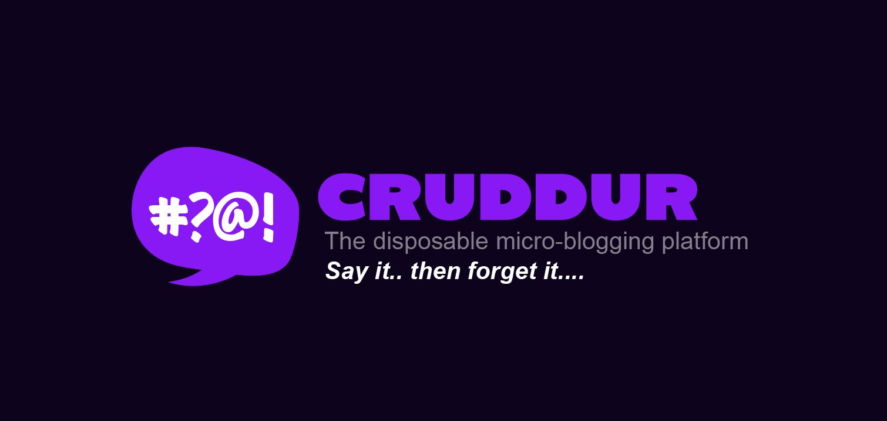

# FREE AWS Cloud Project Bootcamp

- Application: Cruddur
- Cohort: 2023-A1

This is the starting codebase that will be used in the FREE AWS Cloud Project Bootcamp 2023

## Instructions

Check out this [playlist](https://www.youtube.com/playlist?list=PLBfufR7vyJJ7k25byhRXJldB5AiwgNnWv) to access detailed instructions for the bootcamp organized by Andrew Brown, along with guest instructors.

At the start of the bootcamp you need to create a new Github Repository from this [template](https://github.com/omenking/aws-bootcamp-cruddur-2023).

## Journaling Homework

The `/journal` directory contains

- [ ] [Week 0 — Billing and Architecture](journal/week0.md)
- [ ] [Week 1 — App Containerization](journal/week1.md)
- [ ] [Week 2 — Distributed Tracing](journal/week2.md)
- [ ] [Week 3 — Decentralized Authentication](journal/week3.md)
- [ ] [Week 4 — Postgres and RDS](journal/week4.md)
- [ ] [Week 5 — DynamoDB and Serverless Caching](journal/week5.md)
- [ ] [Week 6/7 — Deploying Containers, Solving CORS with a Load Balancer and Custom Domain](journal/week6-7.md)
- [ ] [Week 8](journal/week8.md)
- [ ] [Week 9](journal/week9.md)
- [ ] [Week 10](journal/week10.md)
- [ ] [Week 11](journal/week11.md)
- [ ] [Week 12](journal/week12.md)
- [ ] [Week 13](journal/week13.md)
