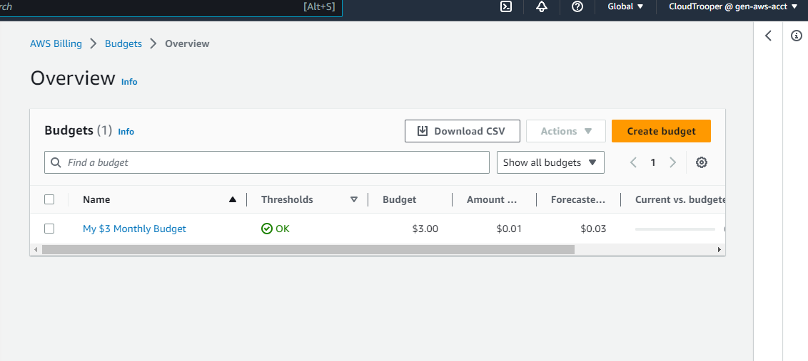

# Week 0 — Billing and Architecture

## Table of Contents

- [Introduction](#introduction)
- [AWS Account Setup](#aws-account-setup)
- [Budget and Billing Alert](#budget-and-billing-alert)
- [Gitpod Workspace Setup](#gitpod-workspace-setup)
- [Conceptual and Logical Architectural Design](#conceptual-and-logical-architectural-design)
- [References](#references)

### Introduction

During the initial week of the project, setup the necessary infrastructure, including the AWS account, budget and billing alerts, as well as configuring the development environment for efficient collaboration. Additionally, I worked on establishing a conceptual and logical architectural design for the project.

### AWS Account Setup

- A [video](https://www.youtube.com/watch?v=uZT8dA3G-S4&list=PLBfufR7vyJJ7k25byhRXJldB5AiwgNnWv&index=7) guide on how to create a free AWS account.
- Sign in as the root user and create an IAM USER, grant Administrative Access to the USER you just created using this [video guide](https://www.youtube.com/watch?v=4EMWBYVggQI&list=PLBfufR7vyJJ7k25byhRXJldB5AiwgNnWv&index=15).

### Budget and Billing Alert

Sign in as the IAM USER, create a Budget and Cloudwatch Alarm to monitor usage and expenditure using this [video guide.](https://www.youtube.com/watch?v=OVw3RrlP-sI&list=PLBfufR7vyJJ7k25byhRXJldB5AiwgNnWv&index=13)


  - Image of the Budget Alarm
  
  
  

  - Image of the Billing Alert
  
  
  
 ### Gitpod Workspace Setup
 
 To streamline development and facilitate collaborative coding, set up Gitpod workspaces for the project.

- Create a Gitpod Account using this quick [video guide](https://www.youtube.com/watch?v=yh9kz9Sh1T8&list=PLBfufR7vyJJ7k25byhRXJldB5AiwgNnWv&index=4)
- Setup Gitpod button on your Github Account for quick access to your workspace environment following this [video guide](https://www.youtube.com/watch?v=A6_c-hJmehs&list=PLBfufR7vyJJ7k25byhRXJldB5AiwgNnWv&index=5)

  #### Install AWS CLI
  
  - launch your Gitpod environment and Install the AWS CLI for Linux on your workspace directory using the instructions in this [link](https://docs.aws.amazon.com/cli/latest/userguide/getting-started-install.html) to run AWS commands.
  
  #### Setup Environment Variables

  Set these credentials for the current bash terminal
  ```
  export AWS_ACCESS_KEY_ID="your_aws_access_key_id"
  export AWS_SECRET_ACCESS_KEY="your_aws_secret_access_key"
  export AWS_DEFAULT_REGION="aws_region_of_your_choosing"
  ```
  
  Persist the credentials in the Gitpod environment
  ```
  gp env AWS_ACCESS_KEY_ID="your_aws_access_key_id"
  gp env AWS_SECRET_ACCESS_KEY="your_aws_secret_access_key"
  gp env AWS_DEFAULT_REGION="aws_region_of_your_choosing"
  ```
  
  #### Confirm that the AWS CLI is configured correctly with the expected user
  ```
  aws sts get-caller-identity
  ```
  
  #### Configure the AWS CLI to load automatically when Gitpod launches by updating .gitpod.yml to include the following task.
  ```
  tasks:
  - name: aws-cli
    env:
      AWS_CLI_AUTO_PROMPT: on-partial
    init: |
      cd /workspace
      curl "https://awscli.amazonaws.com/awscli-exe-linux-x86_64.zip" -o "awscliv2.zip"
      unzip awscliv2.zip
      sudo ./aws/install
      cd $THEIA_WORKSPACE_ROOT
  ```
  
  #### Check your Gitpod user settings to confirm the environment variables
  
  It should look like this. 
  
 
 ### Conceptual and Logical Architectural Design
 
 Create a conceptual and logical architectural design to establish a solid foundation for the project, This involved identifying the key components, their relationships, and defining the overall structure of the system

- Conceptual diagram created using [Lucid Charts](https://lucid.app/lucidchart/1d9fb4e0-44e7-446b-b5b3-985600f8c25f/edit?viewport_loc=4%2C12%2C1464%2C692%2C0_0&invitationId=inv_9e23a1cd-c207-4bd7-ae7b-792935ab1d02)


- Logical diagram created using [Lucid Charts](https://lucid.app/lucidchart/ee12e194-f881-4772-a847-3355b2b0bb6f/edit?viewport_loc=7%2C185%2C2012%2C951%2C0_0&invitationId=inv_4a8ea0bf-014d-4f0d-9967-614aee9062dd)


### References

- AWS Account Setup Guide [Link](https://www.youtube.com/watch?v=uZT8dA3G-S4&list=PLBfufR7vyJJ7k25byhRXJldB5AiwgNnWv&index=7)
- Create an IAM USER [Link](https://www.youtube.com/watch?v=4EMWBYVggQI&list=PLBfufR7vyJJ7k25byhRXJldB5AiwgNnWv&index=15)
- AWS Budget and Billing Alert [Link](https://www.youtube.com/watch?v=OVw3RrlP-sI&list=PLBfufR7vyJJ7k25byhRXJldB5AiwgNnWv&index=13)
- Gitpod Setup [Link](https://www.youtube.com/watch?v=yh9kz9Sh1T8&list=PLBfufR7vyJJ7k25byhRXJldB5AiwgNnWv&index=4)
- Setting up Gitpod Button on your Github Account [Link](https://www.youtube.com/watch?v=A6_c-hJmehs&list=PLBfufR7vyJJ7k25byhRXJldB5AiwgNnWv&index=5)
- AWS CLI [Link](https://docs.aws.amazon.com/cli/latest/userguide/getting-started-install.html)

