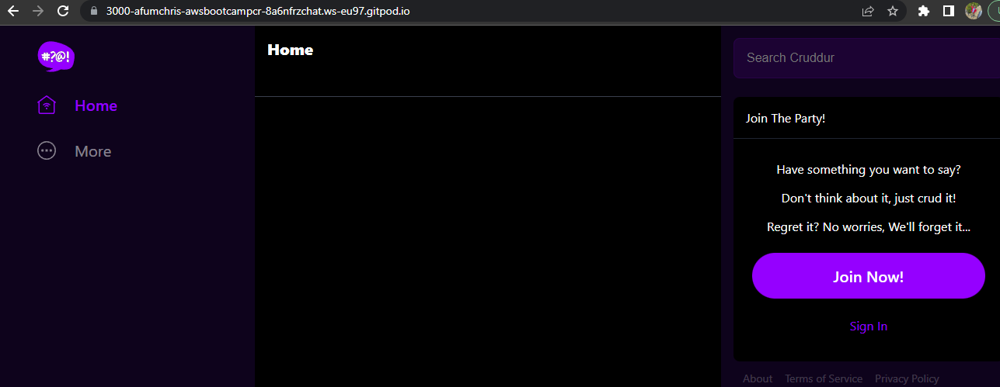
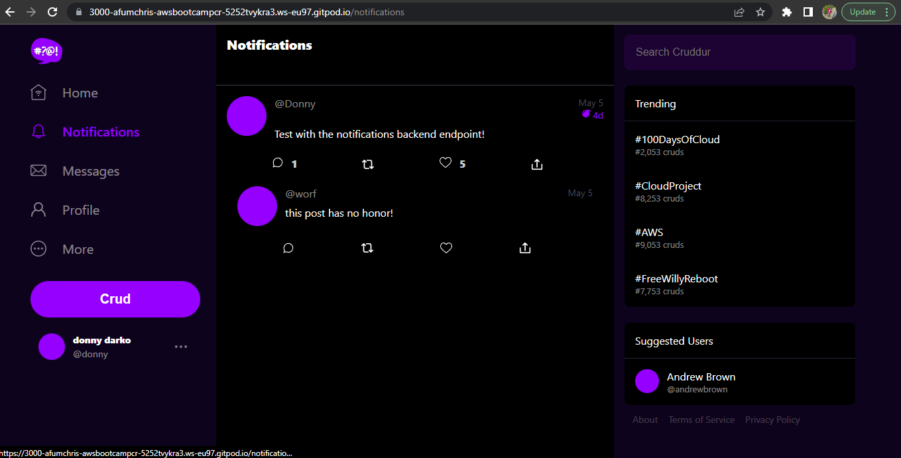
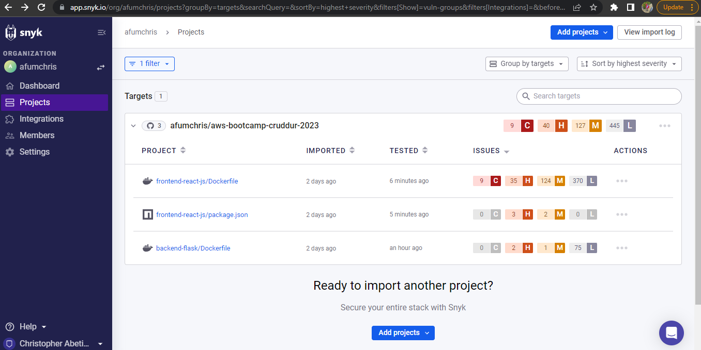

# Week 1 — App Containerization

## Table of Contents

 - [Introduction](#introduction)
 - [Run the Applications Locally](#run-the-applications-locally)
 - [Containerize Backend and Frontend Applications](#containerize-backend-and-frontend-applications)
 - [Pushing Docker Image to Docker Hub](#pushing-docker-image-to-docker-hub)
 - [Container Orchestration with Docker Compose](#container-orchestration-with-docker-compose)
 - [Implementing Notifications](#implementing-notifications)
 - [Working with Databases](#working-with-databases)
 - [Container Security](#container-security)
 - [References](#references)

### Introduction

During the first week of the project, I focused on app containerization to improve the deployment and scalability of our applications. The primary goal was to utilize Docker for packaging our backend and frontend applications into containers, ensuring consistency across different environments.


### Run the Applications Locally

Launched my gitpod environment and ran the backend application locally. This step lets you to verify that the application is functioning correctly before proceeding with containerization

 - Backend Application

   I ran the following commands to install and run flask
   
   ```sh
   cd backend-flask
   export FRONTEND_URL="*"
   export BACKEND_URL="*"
   python3 -m flask run --host=0.0.0.0 --port=4567
   ```
   
   Make sure to unlock port 4567 on the ports tab and then open the link for port 4567 in your browser. After that, append "/api/activities/home" to the URL. By doing so,  you should receive a JSON response as shown below. 
   
    
   
### Containerize Backend and Frontend Applications

created Dockerfiles for each application, specifying the necessary dependencies and instructions to build the containers

  - #### Backend Application

    create a dockefile here: `backend-flask/Dockerfile`, copy the command below and paste it in your Dockerfile
    
    ```dockerfile
    FROM python:3.10-slim-buster

    WORKDIR /backend-flask

    COPY requirements.txt requirements.txt
    RUN pip3 install -r requirements.txt

    COPY . .

    ENV FLASK_ENV=development

    EXPOSE ${PORT}
    CMD [ "python3", "-m" , "flask", "run", "--host=0.0.0.0", "--port=4567"]
    ```

    Build and run the container with the following commands
    
    ```
    cd /workspace/aws-bootcamp-cruddur-2023
    docker build -t  backend-flask ./backend-flask
    docker run --rm -p 4567:4567 -it -e FRONTEND_URL='*' -e BACKEND_URL='*' backend-flask
    ```
    
    Unlock port 4567 and then open the link for port 4567 in your browser. After that, append "/api/activities/home" to the URL. By doing so, you should receive a JSON response like the one you got while running the backend application locally.
    
  - #### Frontend Application

    Run `NPM Install` before building the container since it needs to copy the contents of node_modules
    
    ```
    cd frontend-react-js
    npm i
    ```

    create a dockefile here: `frontend-react-js/Dockerfile`, copy the command below and paste it in your Dockerfile
    
    ```dockerfile
    FROM node:16.18

    ENV PORT=3000

    COPY . /frontend-react-js
    WORKDIR /frontend-react-js
    RUN npm install
    EXPOSE ${PORT}
    CMD ["npm", "start"]
    ```
    
    Build and run the container with the following commands
    
    ```
    cd /workspace/aws-bootcamp-cruddur-2023
    docker build -t frontend-react-js ./frontend-react-js
    docker run --rm -p 3000:3000 -d frontend-react-js
    ```
    
    Unlock port 3000 and then open the link for port 3000 in your browser, at this point you should see a preview of the frontend application.
    
    
    
    Unset the backend and frontend URL with these commands
    
    ```sh
    unset FRONTEND_URL="*"
    unset BACKEND_URL="*"
    ```
    
### Pushing Docker Image to Docker Hub

This step lets you to store and share containerized applications with other team members or deployment environments. 

   After successfully containerizing the applications, I pushed the backend image to my [public repository](https://hub.docker.com/repository/docker/afumchris/aws-bootcamp-cruddur-2023/general) on Docker Hub using the following commands
   
   ```
   docker login -u afumchris
   docker tag aws-bootcamp-cruddur-2023-backend-flask:latest afumchris/aws-bootcamp-cruddur-2023:backend-flask-week1
   docker push afumchris/aws-bootcamp-cruddur-2023:backend-flask-week1
   ```

### Container Orchestration with Docker Compose

To orchestrate multiple containers and simplify development environment setup, I created `docker-compose.yml` at the root of the project

copy and paste the following command in your `docker-compose.yml`

```yaml
version: "3.8"
services:
  backend-flask:
    environment:
      FRONTEND_URL: "https://3000-${GITPOD_WORKSPACE_ID}.${GITPOD_WORKSPACE_CLUSTER_HOST}"
      BACKEND_URL: "https://4567-${GITPOD_WORKSPACE_ID}.${GITPOD_WORKSPACE_CLUSTER_HOST}"
    build: ./backend-flask
    ports:
      - "4567:4567"
    volumes:
      - ./backend-flask:/backend-flask
  frontend-react-js:
    environment:
      REACT_APP_BACKEND_URL: "https://4567-${GITPOD_WORKSPACE_ID}.${GITPOD_WORKSPACE_CLUSTER_HOST}"
    build: ./frontend-react-js
    ports:
      - "3000:3000"
    volumes:
      - ./frontend-react-js:/frontend-react-js

# the name flag is a hack to change the default prepend folder
# name when outputting the image names
networks: 
  internal-network:
    driver: bridge
    name: cruddur
```

Unlock port 3000 and 4567, then open the link for port 3000 in your browser, you should get a frontend application preview like the one you got earlier.

### Implementing Notifications

#### Backend Application

- Added `services/notifications_activities.py` module to handle backend logic for fetching notifications.
- Modified `services/home_activities.py` and `services/user_activities.py` to include notifications logic.
- Updated OpenAPI Specification (openapi-3.0.yml) to include a new /api/activities/notifications endpoint for retrieving notification feed.
         
[Link to the backend commit on changes made](https://github.com/afumchris/aws-bootcamp-cruddur-2023/commit/6b0255bb1707b23837bf33aad59c1e3d98fbc8e1)

#### Frontend Application

- Added import statements for NotificationsFeedPage in `App.js`.
- Created `NotificationsFeedPage.js` and `NotificationsFeedPage.css` files.
- Implemented the NotificationsFeedPage component in `NotificationsFeedPage.js`

[Link to the frontend commit on changes made](https://github.com/afumchris/aws-bootcamp-cruddur-2023/commit/a92bde1190c6c151b48160c56495e2b6c585e337)

Run `docker compose up` and unlock the port 3000, 4567, open the link for 3000 in your browser, sign up and sign in as a new user with confirmation code of 1234 saved in the cookies. click on notifications, its going to look like this.




### Working with Databases

To incorporate databases for future labs into our containerized environment, I added Postgres and DynamoDB containers to `docker-compose.yml` file and modified the `gitpod.yml` file to install postgres at runtime using this [commit](https://github.com/afumchris/aws-bootcamp-cruddur-2023/commit/654a074fd49aac4ea33a781609c72b1d783f0152)

### Container Security

To ensure the security of containerized applications, I focused on identifying and fixing any vulnerabilities. I utilized Snyk, a container security tool, to scan containers for potential security issues.



### References

- Docker Documentation [link](https://docs.docker.com/)
- Docker Compose Documentation [link](https://docs.docker.com/compose/)
- Snyk Documentation [link](https://snyk.io/docs/)
- Top 10 Docker Container Security Best Practices with Tutorial [link](https://www.youtube.com/watch?v=OjZz4D0B-cA&list=PLBfufR7vyJJ7k25byhRXJldB5AiwgNnWv&index=26)
   

