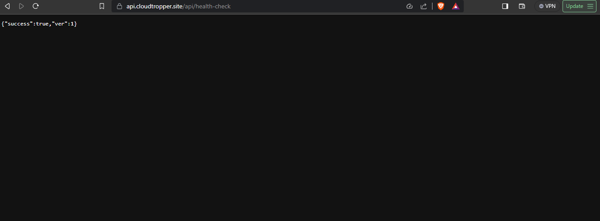
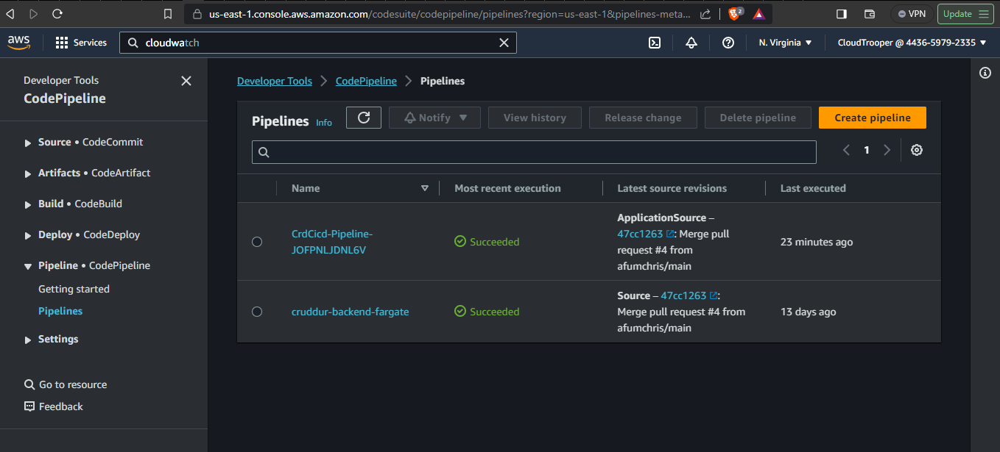
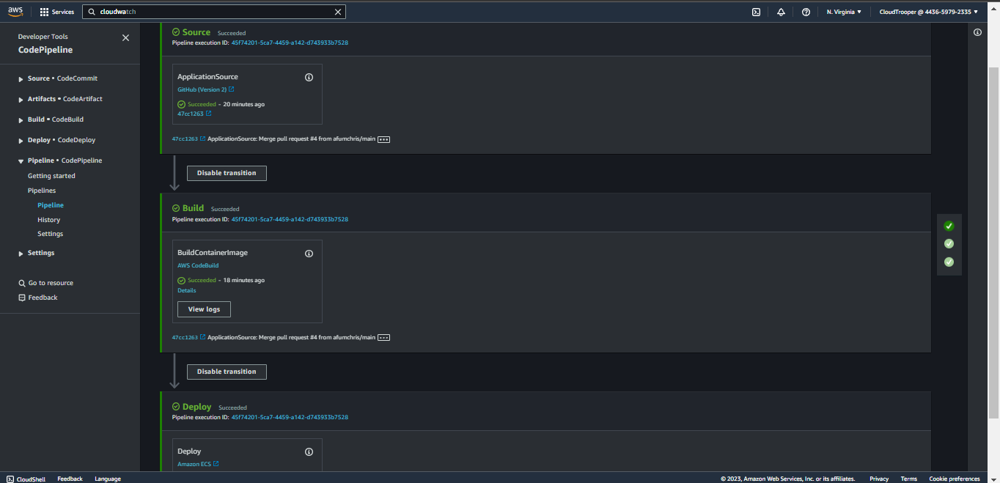

# Week 10 — CloudFormation Part 1

## Table of Contents


- [Introduction](#introduction)
- [Setup](#setup)
- [Networking Stack](#networking-stack)
- [Cluster Stack](#cluster-stack)
- [RDS Stack](#rds-stack)
- [Service Backend-Flask Stack](service-backend-flask-stack)
- [DynamoDB Stack](#dynamodb-stack)
- [CICD Nested Stack](#cicd-nested-stack)
- [Frontend Stack](#frontend-stack)

### Introduction

This week, We will explore CloudFormation, AWS's infrastructure-as-code service and how CloudFormation can simplify infrastructure management.

### Setup

Install `cfn-lint` and `cfn-guard`:

Edit the `.gitpod.yml` file as seen in this [commit](https://github.com/afumchris/aws-bootcamp-cruddur-2023/commit/b8dbbf1703d1703a970bf5d907a0ea0160f4f3e7#diff-370a022e48cb18faf98122794ffc5ce775b2606b09a9d1f80b71333425ec078e) to install `cfn-lint` and `cfn-guard`, as part of our setup process. These tools will help us ensure the quality and security of our AWS CloudFormation templates. `cfn-lint` is used for template linting and checking for AWS best practices, while `cfn-guard` is a policy-as-code framework to enforce additional security and compliance rules.

Create an S3 Bucket:

Create an Amazon S3 bucket `cfn-artifacts-adikaifeanyi` to store your CloudFormation templates using the AWS console and set the bucket name as an env var using the command below.

```sh
export CFN_BUCKET="cfn-artifacts-adikaifeanyi"
gp env CFN_BUCKET="cfn-artifacts-adikaifeanyi"
```

### Networking Stack

Create the following files(make sure to change the parameters to yours):
  - [aws/cfn/networking/template.yaml](https://github.com/afumchris/aws-bootcamp-cruddur-2023/blob/main/aws/cfn/networking/template.yaml)
  - [aws/cfn/networking/config.toml](https://github.com/afumchris/aws-bootcamp-cruddur-2023/blob/main/aws/cfn/networking/config.toml)
  - [bin/cfn/networking](https://github.com/afumchris/aws-bootcamp-cruddur-2023/blob/main/bin/cfn/networking) run the bash script to deploy the Networking stack.

### Cluster Stack

Create the following files:
  - [aws/cfn/cluster/template.yaml](https://github.com/afumchris/aws-bootcamp-cruddur-2023/blob/main/aws/cfn/cluster/template.yaml)
  - [aws/cfn/cluster/config.toml](https://github.com/afumchris/aws-bootcamp-cruddur-2023/blob/main/aws/cfn/cluster/config.toml)
  - [bin/cfn/cluster](https://github.com/afumchris/aws-bootcamp-cruddur-2023/blob/main/bin/cfn/cluster) run the bash script to deploy the cluster stack.

Navigate to the AWS console and edit Route53 type A records for `api.cloudtropper.site` to point to the CrdClusterALB

### RDS Stack

Execute the following command `export DB_PASSWORD="your_DB_PASSWORD"` before running the bash script

Create the following files:
  - [aws/cfn/db/template.yaml](https://github.com/afumchris/aws-bootcamp-cruddur-2023/blob/main/aws/cfn/db/template.yaml)
  - [aws/cfn/db/config.toml](https://github.com/afumchris/aws-bootcamp-cruddur-2023/blob/main/aws/cfn/db/config.toml)
  - [bin/cfn/db](https://github.com/afumchris/aws-bootcamp-cruddur-2023/blob/main/bin/cfn/db) run the bash script to deploy the db stack.

After the process is completed, retrieve `RDS endpoint` and then proceed to update the `CONNECTION_URL` within AWS System Manager's Parameter Store

### Service Backend-Flask Stack

Create the following files:
  - [aws/cfn/db/template.yaml](https://github.com/afumchris/aws-bootcamp-cruddur-2023/blob/main/aws/cfn/service/config.toml)
  - [aws/cfn/db/config.toml](https://github.com/afumchris/aws-bootcamp-cruddur-2023/blob/main/aws/cfn/service/template.yaml)
  - [bin/cfn/service](https://github.com/afumchris/aws-bootcamp-cruddur-2023/blob/main/bin/cfn/service) run the bash script to deploy the service stack.

After deploying the service stack, Modify the health check configurations for the target group associated with `CrdClu-Backed-xxx` within the advanced settings, specify the health check port to override and set it to `4567`. The screenshot below indicates that https://api.cloudtropper.site/api/health-check (backend service) is working.



### DynamoDB Stack

Edit the `gitpod.yml` file as seen in this [commit](https://github.com/afumchris/aws-bootcamp-cruddur-2023/commit/794b870a635090164d062f643f15bd9e3c7002ce#diff-370a022e48cb18faf98122794ffc5ce775b2606b09a9d1f80b71333425ec078e) to install AWS SAM packages

Create the following files:

  - [ddb/function/lambda_function.py](https://github.com/afumchris/aws-bootcamp-cruddur-2023/blob/main/ddb/function/lambda_function.py)
  - [ddb/template.yaml](https://github.com/afumchris/aws-bootcamp-cruddur-2023/blob/main/ddb/template.yaml)
  - [ddb/config.toml](https://github.com/afumchris/aws-bootcamp-cruddur-2023/blob/main/ddb/config.toml)

Create and run the following bash scripts to deploy the `ddb` stack:
  - [ddb/build](https://github.com/afumchris/aws-bootcamp-cruddur-2023/blob/main/ddb/build) 
  - [ddb/package](https://github.com/afumchris/aws-bootcamp-cruddur-2023/blob/main/ddb/package)
  - [ddb/deploy](https://github.com/afumchris/aws-bootcamp-cruddur-2023/blob/main/ddb/deploy)

### CI/CD Nested Stack

Create the following files:

  - [aws/cfn/cicd/nested](https://github.com/afumchris/aws-bootcamp-cruddur-2023/blob/main/aws/cfn/cicd/nested/codebuild.yaml)
  - [aws/cfn/cicd/template.yaml](https://github.com/afumchris/aws-bootcamp-cruddur-2023/blob/main/aws/cfn/cicd/template.yaml)
  - [aws/cfn/cicd/config.toml](https://github.com/afumchris/aws-bootcamp-cruddur-2023/blob/main/aws/cfn/cicd/config.toml)
  - [bin/cfn/cicd]([bin/cfn/cicd](https://github.com/afumchris/aws-bootcamp-cruddur-2023/blob/main/bin/cfn/cicd)) run the bash script to deploy the CI/CD Nested Stack

Navigate to AWS Console's CodePipeline section to verify the successful deployment of your pipeline as shown below





### Frontend Stack

Navigate to the hosted zone for "your_domain_name" in Route 53, delete the A record set without specifying a specific record name in [week 6/7 domain configuration](https://github.com/afumchris/aws-bootcamp-cruddur-2023/blob/main/journal/week6-7.md#custom-domain-configuration).

Create the following files:

  - [aws/cfn/frontend/template.yaml](https://github.com/afumchris/aws-bootcamp-cruddur-2023/blob/main/aws/cfn/frontend/template.yaml)
  - [aws/cfn/frontend/config.toml](https://github.com/afumchris/aws-bootcamp-cruddur-2023/blob/main/aws/cfn/frontend/config.toml)
  - [bin/cfn/frontend](https://github.com/afumchris/aws-bootcamp-cruddur-2023/blob/main/bin/cfn/frontend) run the bash script to deploy the frontend Stack


 


