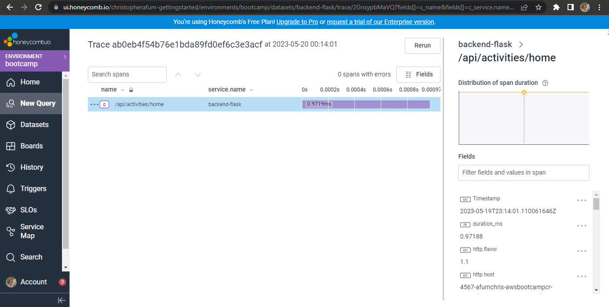
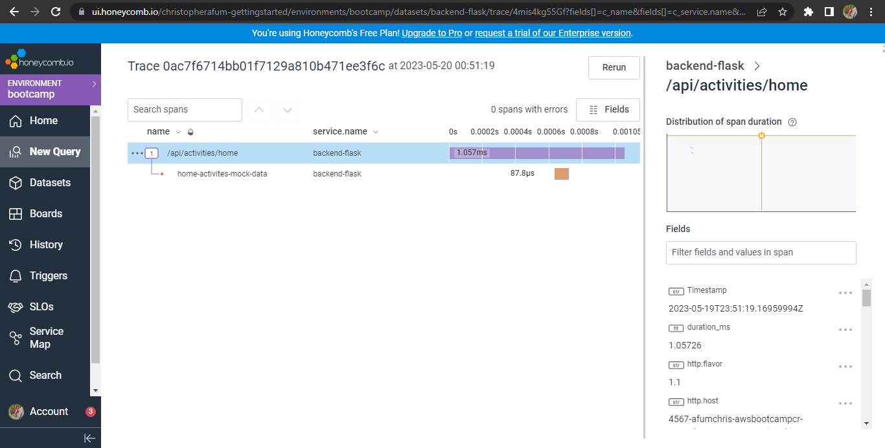
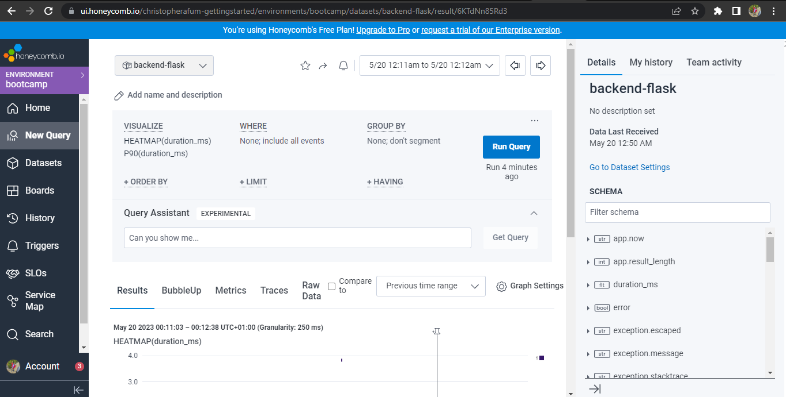
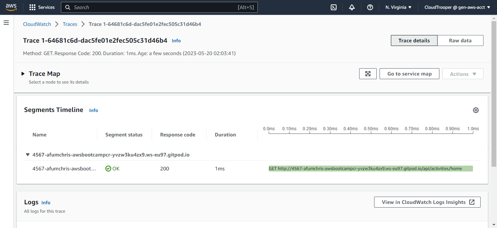
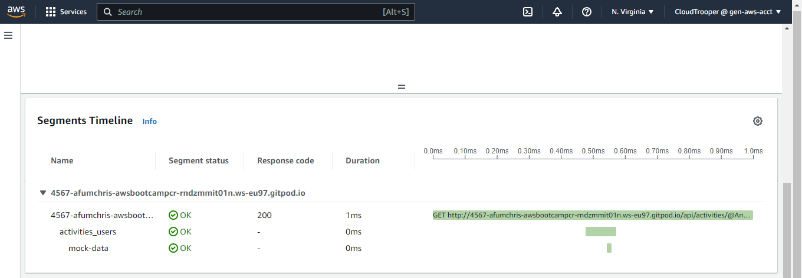
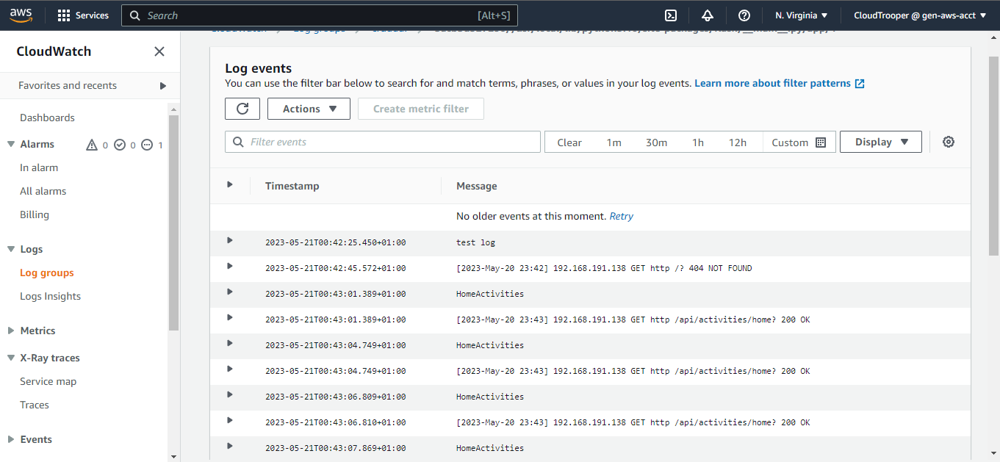

# Week 2 — Distributed Tracing

## Table of Contents:

- [Introduction](#introduction)
- [Honeycomb Integration](#honeycomb-integration)
- [AWS X-Ray Implementation](#aws-x-ray-implementation)
- [AWS CloudWatch Log](#aws-cloudwatch-log)
- [Modify the gitpod file to open ports automatically and install npm at runtime](#modify-the-gitpod-file-to-open-ports-automatically-and-install-npm-at-runtime)
- [References](#references)

### Introduction

During the second week of our project, we focused on implementing distributed tracing to enhance the observability and performance of our system. This involved integrating various tools and services to capture and analyze trace data.

### Honeycomb Integration

Integrate Honeycomb in the Backend Application to provide tracing capabilities that enable us to gather and analyze trace data.

- Create a new environment called "bootcamp" on the [Honeycomb website](https://www.honeycomb.io/) and obtain the API key associated with it.

- Use the following commands to set the Honeycomb API Key as an environment variable

```sh
  
    export HONEYCOMB_API_KEY="your API key"
    gp env HONEYCOMB_API_KEY="your API key"
 ```
    
- Utilize this [commit](https://github.com/afumchris/aws-bootcamp-cruddur-2023/commit/affcbd358a33882965e15d515dd269da3e87903f) to implement the following modifications in order to instrument Honeycomb:

  - Open the `backend-flask/requirements.txt` file and add the required dependencies for OpenTelemetry and pip install it.

  - In the `docker-compose.yml` file, add the following environment variables for the OpenTelemetry exporter and tracing configuration.

  - Open the `backend-flask/app.py` file and make the following changes:

      - Import the necessary modules and services related to distributed tracing.
      - Initialize tracing and an exporter to send trace data to Honeycomb.
      - Instrument the Flask application using the OpenTelemetry Flask Instrumentor.
      - Instrument outgoing requests using the OpenTelemetry Requests Instrumentor.


Execute the command `docker-compose` up to run the Docker Compose configuration, ensure that port 4567 is unlocked by accessing the ports tab in the respective settings, open the link corresponding to port 4567 in your preferred web browser, once the page loads, append `/api/activities/home` to the URL. To view the traces, navigate to the Honeycomb website and refer to the provided screenshot for guidance.



#### Add Spans and Attributes

By utilizing this [commit](https://github.com/afumchris/aws-bootcamp-cruddur-2023/commit/4b2086734354fab2ef3cc7159f3badb9e45e3070), implement the following changes in the `backend-flask/services/home_activities.py` file:

  - Add a span called `mock-data` to the tracer named `home.activities`.
  - Incorporate an attribute called `app.now` to the newly created span.

These modifications were made to facilitate distributed tracing and capture the current timestamp within the application.


Execute the command `docker-compose` up to run the Docker Compose configuration, ensure that port 4567 is unlocked by accessing the ports tab in the respective settings, open the link corresponding to port 4567 in your preferred web browser, once the page loads, append `/api/activities/home` to the URL. To view the traces, navigate to the Honeycomb website and refer to the provided screenshot for guidance.




You can utilize queries within Honeycomb to explore traces, as demonstrated in the accompanying screenshot.




### AWS X-Ray Implementation

In addition to Honeycomb, we explored the implementation of AWS X-Ray for distributed tracing. We instrumented our applications and services with X-Ray to capture and visualize the end-to-end flow of requests.

Utilize this [commit](https://github.com/afumchris/aws-bootcamp-cruddur-2023/commit/d70ca81faf97c39e6618db41d15f7db21ca87cc7) to implement the following modifications in order to instrument X-RAY:

  - Add `aws/json/xray.json` file:

    - Create a `JSON` file for X-Ray configuration.
    - Add a sampling rule for X-Ray with specific settings.

    Run the following command lines to create tracing groups and sampling rules:
    
```sh 

aws xray create-group --group-name "Cruddur" --filter-expression "service(\"backend-flask\")" 
aws xray create-sampling-rule --cli-input-json file://aws/json/xray.json
```

  - Modify `backend-flask/app.py`:

    - Imported necessary modules for X-Ray integration.
    - Configured X-Ray recorder with the service name and dynamic naming.
    - Added X-Ray middleware to the Flask application.

  - Update `backend-flask/requirements.txt`:

    - Add aws-xray-sdk library for X-Ray integration and pip install it.

  - Modify `docker-compose.yml`:

    - Add environment variables for X-Ray integration (AWS_XRAY_URL and AWS_XRAY_DAEMON_ADDRESS).
    - Add a new service xray-daemon for running the AWS X-Ray daemon.

Execute the command `docker-compose` up to run the Docker Compose configuration, ensure that port 4567 is unlocked by accessing the ports tab in the respective settings, open the link corresponding to port 4567 in your preferred web browser, once the page loads, append `/api/activities/home` to the URL. To view the traces, navigate to X-RAY on AWS console and refer to the provided screenshot for guidance.



#### Add Segments and Subsegments

Utilize this [commit]() to implement the following modifications in order to add segments and subsegments:

  - Modify `backend-flask/app.py`:

    - Add @xray_recorder.capture decorator to the `data_home()` function for X-Ray tracing.
    - Add @xray_recorder.capture decorator to the `data_handle()` function for X-Ray tracing.
    - Add @xray_recorder.capture decorator to the `data_show_activity()` function for X-Ray tracing.


  - Modify `backend-flask/services/user_activities.py`:

    - Add import statement for aws_xray_sdk.core.xray_recorder.
    - Add X-Ray subsegment to the `run()` function to capture a mock-data segment.
    - Added metadata to the X-Ray subsegment to include the current time and the size of the data.

Execute the command `docker-compose` up to run the Docker Compose configuration, ensure that port 4567 is unlocked by accessing the ports tab in the respective settings, open the link corresponding to port 4567 in your preferred web browser, once the page loads, append `/api/activities/home` to the URL. To view the traces, navigate to X-RAY on AWS console and refer to the provided screenshot for guidance.




### AWS CloudWatch Log

To further enhance our observability, we integrated AWS CloudWatch Log for centralized log management. We configured our applications and services to send logs to CloudWatch, providing us with a centralized location to analyze and monitor log data.

 Utilize this [commit](https://github.com/afumchris/aws-bootcamp-cruddur-2023/commit/fbeded4441ab69a696168b9871e38549be31fcf1) to make the following modifications to implement cloudwatch log:

  - Add `WatchTower` in the `backend-flask/requirements.txt` file. Then, install it using pip.
  - Configure the Logger in the `backend-flask/app.py` file to utilize CloudWatch for logging.
  - In the `backend-flask/services/home_activities.py` file, modify the `run()` function of the HomeActivities class to utilize the logger parameter. The modification involves incorporating the logger for logging purposes within the function.
  - Modify `docker-compose.yml`, add the necessary environment variables for AWS credentials.

Execute the command `docker-compose` up to run the Docker Compose configuration, ensure that port 4567 is unlocked by accessing the ports tab in the respective settings, open the link corresponding to port 4567 in your preferred web browser, once the page loads, append `/api/activities/home` to the URL. To view logs, navigate to cloudwatch log on AWS console and refer to the provided screenshot for guidance.



### Modify the gitpod file to open ports automatically and install npm at runtime

  - Update `gitpod.yml` file with the following command to open ports automatically

```yaml

ports:
  - name: frontend
    port: 3000
    onOpen: open-browser
    visibility: public
  - name: backend
    port: 4567
    visibility: public
  - name: xray-daemon
    port: 2000
    visibility: public
 ```

  - Update `gitpod.yml` file with the following command to install `npm` at runtime

```yaml

- name: react-js
    command: |
      cd frontend-react-js
      npm i
 ```
 
### References

- Honeycomb Documentation [link](https://docs.honeycomb.io/)
- AWS X-Ray Documentation [link](https://docs.aws.amazon.com/xray/latest/devguide/aws-xray.html)
- How to add custom X-Ray Segments for Containerised Flask Application [link](https://olley.hashnode.dev/aws-free-cloud-bootcamp-instrumenting-aws-x-ray-subsegments)
- AWS CloudWatch Documentation [link](https://docs.aws.amazon.com/cloudwatch/index.html)

