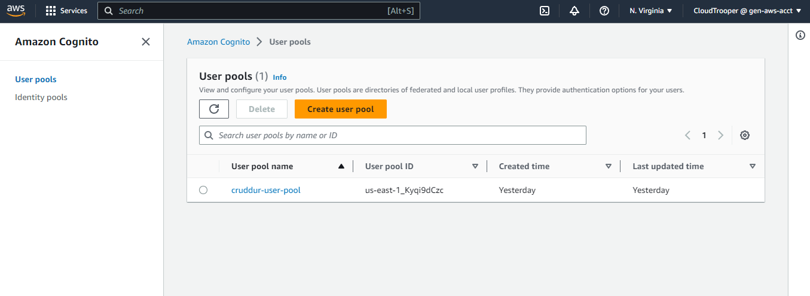

# Week 3 — Decentralized Authentication

## Table of Contents

- [Introduction](#introduction)
- [Amazon Cognito User Pool](#amazon-cognito-user-pool)
- [Installation and Configuration of AWS Amplify](#installation-and-configuration-of-aws-amplify)
- [Implementing API Calls to Amazon Cognito for Custom Signup Signin Confirmation and Recovery Pages](#implementing-api-calls-to-amazon-cognito-for-custom-signup-signin-confirmation-and-recovery-pages)
- [Server-Side Verification of JWT](#server-side-verification-of-jwt)
- [Fix Expiring Token](#fix-expiring-token)
- [References](#references)

### Introduction

During the third week of the project, our focus was on implementing decentralized authentication using Amazon Cognito. This approach offers a secure and scalable solution for user authentication.

### Amazon Cognito User Pool

Amazon Cognito User Pool allows us to create and manage a user directory, handle user sign-up and sign-in processes, and manage user attributes and settings.

Navigate to Amazon Cognito on the AWS console and create a new user pool with the following configurations:

  - Log in to your AWS Console.
  - Ensure you are in the desired AWS region for your service.
  - Locate the Cognito service by searching for it in the console.
  - In the left side panel of the Cognito service, click on the `UserPool` tab.
  - Click on `Create UserPool` to start creating a new user pool.
  - On the `Authentication providers` page, choose the desired sign-in option for the Cognito user pool. In this case, select `Email`.
  - Set the password policy to `Cognito Default`.
  - Under `Multi-factor authentication`, select `No MFA`.
  - For user account recovery, check the `Email only` box.
  - In the `Required attributes` section, select `Name` and `Preferred username`.
  - Choose `Send email with Cognito`.
  - Enter a name for your User Pool. For example, `cruddur-user-pool`.
  - Keep the initial app client as a `Public client` and enter `cruddur` as the app client name.
  - Review the configurations and ensure they match your requirements.
  - Finally, create the user pool.

By following these steps, you will be able to log in to your AWS Console, select the desired region, locate the Cognito service, and create a user pool with the specified configurations, We can retrieve the user pool id and app client id to configure AWS Amplify.

### Installation and Configuration of AWS Amplify

To integrate Amazon Cognito into our application, we installed and configured the Amplify framework. Amplify simplifies the development process by providing a set of libraries, tools, and UI components that work seamlessly with AWS services, including Amazon Cognito.

To install and configure the Amplify client-side library for Amazon Cognito, follow these steps, utilizing this [commit](https://github.com/afumchris/aws-bootcamp-cruddur-2023/commit/52550a07c58e4d13a1543e48b77728832c1198ef):

  - Make sure you are in the `frontend-react-js` directory of your project, install Amplify by running the command `npm i aws-amplify --save`. This will update the package.json and package-lock.json files to include the Amplify package.
  - Updated the environment variables in the `docker-compose.yml` file to configure the frontend application with the AWS project region, AWS Cognito region, AWS user pools ID, and client ID.
  - Configured Amplify in the `frontend-react-js/src/App.js` file with the specified AWS project region, AWS Cognito region, AWS user pools ID, and client ID.

### Implementing API Calls to Amazon Cognito for Custom Signup Signin Confirmation and Recovery Pages

By leveraging the Amplify libraries, we were able to interact with the User Pool and perform various authentication actions securely and efficiently.

To implement API calls to Amazon Cognito for Custom Signup, Signin, Confirmation and Recovery Pages, follow these steps, utilizing this [commit](https://github.com/afumchris/aws-bootcamp-cruddur-2023/commit/2961e458c0e06e827a4dea1eb7857ad341da78d6):

  - Update the `App.js` file to use the correct `client_id` for the User Pool.
  - Modify the `DesktopSidebar.js` component to display the trending and suggested sections based on user authentication status.
  - Update the `ProfileInfo.js` component to handle user sign-out using the Auth.signOut method.
  - Modify the `ConfirmationPage.js` component to resend confirmation codes and handle user confirmation using the Auth.confirmSignUp method.
  - Update the `HomeFeedPage.js` component to check user authentication status using the Auth.currentAuthenticatedUser method.
  - Modify the `RecoverPage.js` component to handle password recovery and confirmation using the Auth.forgotPassword and Auth.forgotPasswordSubmit methods.
  - Update the `SigninPage.js` component to handle user sign-in using the Auth.signIn method.
  - Modify the `SignupPage.js` component to handle user sign-up using the Auth.signUp method.

signup page

signin page

confirmation page

recovery page 

### Server-Side Verification of JWT

To enhance the security of our authentication system, we implemented server-side verification of JSON Web Tokens (JWT).

The changes as seen in this [commit](https://github.com/afumchris/aws-bootcamp-cruddur-2023/commit/f5d8e7b5fbb80a0c241eec9de031a85bcd554877) include integrating AWS Cognito for JWT token verification, configuring CORS, and adding `extra_crud` when cognito_user_id != None.

Upon signing in with the newly created user, the home page will display In the lower-left corner, the name and preferred username of the user will be presented. Additionally, a message from Lore, which we incorporated in the `backend-flask/services/home_activities.py` file as `extra_crud`, will be showcased at the top of the page.

Once signed out, the home page will be displayed without the message by Lore.

### Fix Expiring Token

To address the issue of an expiring token, modify the following files as seen in this [commit](https://github.com/afumchris/aws-bootcamp-cruddur-2023/commit/1c2f9b4a3c4c437bd7a111014b9500479e188c62):

  - `frontend-react-js/src/components/MessageForm.js`:
    - Add import statement for `getAccessToken` function from the `CheckAuth` module.
    - Update the `await getAccessToken()` line to call the `getAccessToken` function.
    - Update the `headers` object in the `fetch` request to use the `access_token` variable instead of directly accessing `localStorage.getItem("access_token")`.  
  - `frontend-react-js/src/lib/CheckAuth.js`:
    - Export the `getAccessToken` function alongside the existing `checkAuth` function.
    - Modify the implementation of the `getAccessToken` function to store the access token in the local storage.  
  - `frontend-react-js/src/pages/HomeFeedPage.js`, `MessageGroupNewPage.js`, `MessageGroupPage.js`, and `MessageGroupsPage.js`:
    - Add import statement for `getAccessToken` function from the `CheckAuth` module.
    - Update the `await getAccessToken()` line to call the `getAccessToken` function.
    - Update the `headers` object in the `fetch` request to use the `access_token` variable instead of directly accessing `localStorage.getItem("access_token")`.

### References

- AWS Amplify Documentation [link](https://docs.aws.amazon.com/amplify/index.html)
- Amazon Cognito Documentation [link](https://docs.aws.amazon.com/cognito/index.html)

