# Week 5 — DynamoDB and Serverless Caching

## Table of Contents:

  - [Introduction](#introduction)
  - [Data Modelling](#data-modelling)
  - [Setting up DynamoDB Local](#setting-up-dynamodb-local)
  - [DynamoDB Utility Scripts](#dynamodb-utility-scripts)
  - [Implement Conversations with DynamoDB Local](#implement-conversations-with-dynamodb-local)
  - [Implement DynamoDB Stream with AWS Lambda](#implement-dynamodb-stream-with-aws-lambda)
  - [Fix Timezone](#fix-timezone)
  - [References](#references)

### Introduction

This week, we explored the implementation of DynamoDB, a fully managed NoSQL database service provided by Amazon Web Services (AWS). DynamoDB offers scalability, reliability, and low latency, making it suitable for various applications. We covered the process of setting up DynamoDB locally, data modeling techniques, utility scripts for managing DynamoDB, and implementing conversations and DynamoDB streams using AWS Lambda.

### Data Modelling

In this particular scenario, we employ the Single Table Design approach to store all related data. By adopting this technique, we can achieve efficient and reliable data retrieval. Storing similar items within the same table also helps to simplify the application's complexity, leading to improved performance.

#### Access Patterns:

  - Pattern A - Displaying Messages:
This pattern allows users to view a list of messages belonging to a specific message group. The messages are typically presented in descending order, providing users with an overview of their conversations.
  - Pattern B - List of Conversations (All Direct Messages):
This access pattern provides users with a comprehensive list of message groups, giving them an overview of all their direct message conversations. Users can quickly access and navigate through different message groups, facilitating efficient communication.
  - Pattern C - Creating a New Message in a New Message Group:
With this pattern, users can initiate a new conversation by creating a new message in a previously nonexistent message group. This functionality facilitates the start of fresh discussions between users.
  - Pattern D - Creating a New Message in an Existing Message Group:
This pattern allows users to add a new message to an existing message group, thereby extending the ongoing conversation with other users.

To address the specific access patterns, our DynamoDB table requires the implementation of the following code to distinguish between different types of data queries and manipulations:

```python
my_message_group = {
    'pk': {'S': f"GRP#{my_user_uuid}"},
    'sk': {'S': last_message_at},
    'message_group_uuid': {'S': message_group_uuid},
    'message': {'S': message},
    'user_uuid': {'S': other_user_uuid},
    'user_display_name': {'S': other_user_display_name},
    'user_handle':  {'S': other_user_handle}
}

other_message_group = {
    'pk': {'S': f"GRP#{other_user_uuid}"},
    'sk': {'S': last_message_at},
    'message_group_uuid': {'S': message_group_uuid},
    'message': {'S': message},
    'user_uuid': {'S': my_user_uuid},
    'user_display_name': {'S': my_user_display_name},
    'user_handle':  {'S': my_user_handle}
}

message = {
    'pk':   {'S': f"MSG#{message_group_uuid}"},
    'sk':   {'S': created_at},
    'message': {'S': message},
    'message_uuid': {'S': message_uuid},
    'user_uuid': {'S': my_user_uuid},
    'user_display_name': {'S': my_user_display_name},
    'user_handle': {'S': my_user_handle}
}
```

### Setting up DynamoDB Local

Set `AWS_COGNITO_USER_POOL_ID` as enviroment variable using this command:

```sh
export AWS_COGNITO_USER_POOL_ID="your AWS_COGNITO_USER_POOL_ID"
gp env AWS_COGNITO_USER_POOL_ID="your AWS_COGNITO_USER_POOL_ID"
```

Run `pip install -r requirements.txt` to install `boto3` locally, which is the AWS SDK for Python. Boto3 makes it easy to integrate your Python application, library, or script with AWS services including Amazon DynamoDB, and more.

using this [commit](https://github.com/afumchris/aws-bootcamp-cruddur-2023/commit/b54210c4c8a4a10a0e4b90ba61b57347f864b42b) make the following changes:

  - `.gitpod.yml`: Added a new task named `flask` to install python libraries automatically at the launch of a new workspace environment.
  - `backend-flask/bin/cognito/list-users`: This script lists the users in the Cognito user pool associated with the application.
It retrieves the AWS_COGNITO_USER_POOL_ID environment variable and uses the boto3 library to interact with Cognito.
The script prints the list of users and creates a dictionary mapping the user handle to the Cognito sub (user identifier).
  - `backend-flask/bin/db/setup`: modified it to run a Python script `update_cognito_user_ids` to update the Cognito user IDs in the database.
  - `backend-flask/bin/db/update_cognito_user_ids`: This Python script updates the Cognito user IDs in the database for existing users.
  - `backend-flask/db/seed.sql`: Modified the script to add another user.
  - `docker-compose.yml`: Updated the CONNECTION_URL environment variable for the backend-flask service to use the specified PostgreSQL connection URL.

Run `docker compose up` with the following commands as shown in the screenshot below for confirmation:


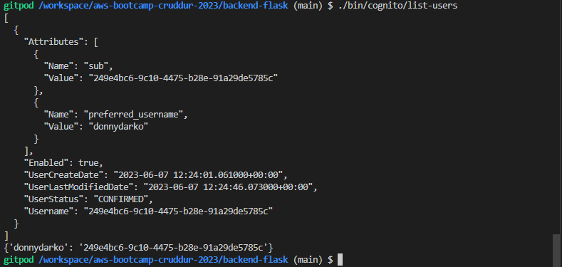


### DynamoDB Utility Scripts

Create the following utility scripts using this [commit](https://github.com/afumchris/aws-bootcamp-cruddur-2023/commit/e2096e9a35e09418df10872e102855ea19041fb5) and this [commit](https://github.com/afumchris/aws-bootcamp-cruddur-2023/commit/a062d274bd00347f92e668855212516cdb66a2af) to aid in managing and administering DynamoDB:

  - `backend-flask/bin/ddb/schema-load`: creates a table named "cruddur-messages," either on DynamoDB local or on the AWS platform for prod.
  - `backend-flask/bin/ddb/drop`: drops a DynamoDB table.
  - `backend-flask/bin/ddb/list-tables`: lists DynamoDB tables created.
  - `backend-flask/bin/ddb/patterns/get-conversation`: queries a DynamoDB table for a conversation.
  - `backend-flask/bin/ddb/patterns/list-conversations`: list content related to querying a DynamoDB table for conversations.
  - `backend-flask/bin/ddb/scan`: scans all items in a DynamoDB table.
  - `backend-flask/bin/ddb/seed`: loads the seed data into the dynamoDB table.
  - Modified the file `backend-flask/db/seed.sql` to include additional insert statements.
  - Modified the file `backend-flask/lib/db.py` to add new functions and modify existing ones related to printing SQL statements, querying JSON objects, and querying a single value.


schema-load and list-tables:

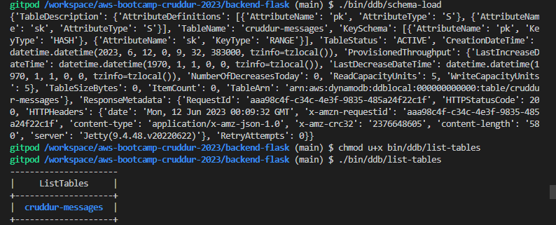

seed data:

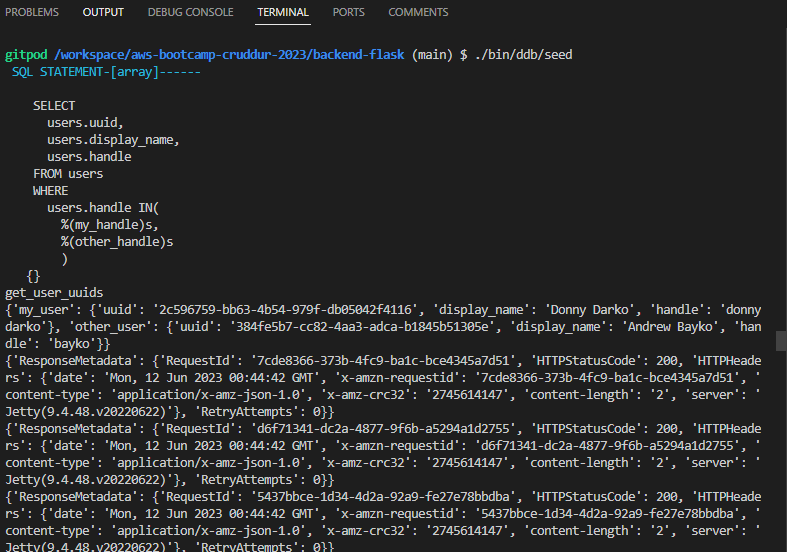

scanning items:

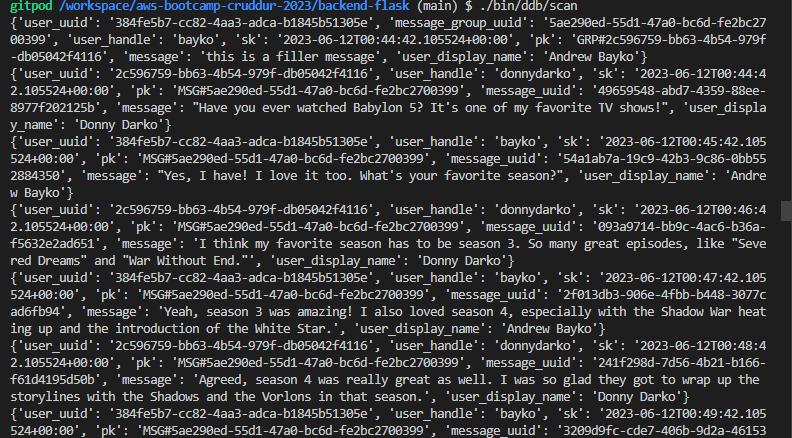

get-conversation:

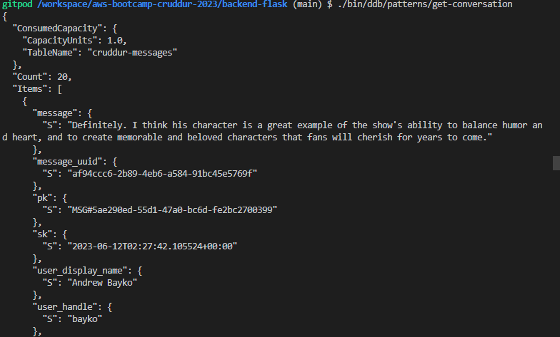

list-conversations:

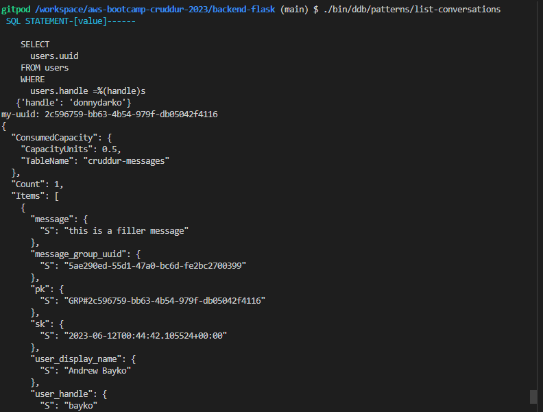


### Implement Conversations with DynamoDB Local

Make the following changes as seen in this [commit](https://github.com/afumchris/aws-bootcamp-cruddur-2023/commit/58109f3977e7095d6a8e30ee1eec6d240f38c808?diff=unified) to implement conversations with DynamoDB Local.

Run `docker compose up`, `./bin/db/setup` to setup local database `cruddur`, `./bin/ddb/schema-load` to create `cruddur-messages` table and `./bin/ddb/seed` to seed data into the table.

Check the frontend `url`  and append the group `uuid` for filler message as shown below:

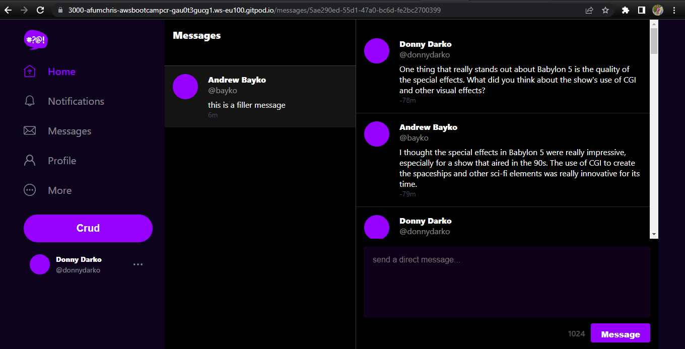

Append `/messages/new/londo` to create and update new messages in a new message group with londo

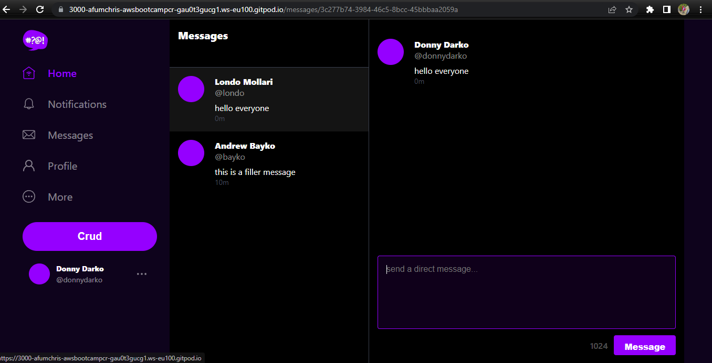

Append `/messages/new/bayko` to create and update new messages in a new message group with bayko

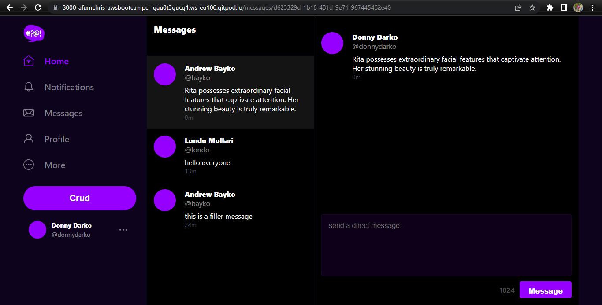


### Implement DynamoDB Stream with AWS Lambda

This [commit](https://github.com/afumchris/aws-bootcamp-cruddur-2023/commit/309d0d961d95c4bfca95f46b58bbadb6dc65dcd5) outlines the changes made to integrate DynamoDB Stream processing and perform schema modifications in the project. Files modified:

Files Modified:

  - `aws/lambdas/cruddur-messaging-stream.py`: Added a Lambda function to handle DynamoDB Stream events and update related records in the cruddur-messages table.
  - `aws/policies/cruddur-message-stream-policy.json`: Created an AWS IAM policy to grant necessary permissions for the Lambda function to access DynamoDB.
  - `backend-flask/bin/ddb/schema-load`: Updated the schema definition to include a new table, cruddur-messages, and a global secondary index, message-group-sk-index.
  - `docker-compose.yml`: Modified the environment variable AWS_ENDPOINT_URL to point to the actual DynamoDB endpoint instead of the local development endpoint

Run `docker compose up`, `./bin/db/setup` and `./bin/ddb/schema-load prod` to create DynamoDB table called `cruddur-messages` on the AWS console.

To configure the necessary components on AWS for the "cruddur-messages" table, follow these steps:

  - DynamoDB:
    - Navigate to the DynamoDB service in the AWS Management Console.
    - Open the `cruddur-messages` table.
    - Enable DynamoDB Streams for the table.
    - Select the `New image` option to capture the entire item image in the stream.
  - VPC:
    - Access the VPC console in the AWS Management Console.
    - Create an endpoint called `cruddur-ddb` for the DynamoDB service.
    - Choose the default VPC and route table for the endpoint configuration.
    - Grant full access for custom policy
  - Lambda:
    - Open the Lambda console in the AWS Management Console.
    - Create a new Lambda function named `cruddur-messaging-stream`.
    - In the advanced settings, enable VPC for the Lambda function and associate it with the desired VPC, subnet group and security group
    - Deploy the code found in the file `aws/lambdas/cruddur-messaging-stream.py` for the function's implementation.
    - Add the `AWSLambdaInvocation-DynamoDB` permission to the Lambda IAM role.
    - create inline policies for additional permissions using the JSON file `aws/policies/cruddur-message-stream-policy.json`.
  - DynamoDB Trigger:
    - Return to the DynamoDB console.
    - Configure a new trigger for the `cruddur-messages` table.
    - Select 1 for batch size
    - Select the `cruddur-messaging-stream` Lambda function as the trigger.

Run `docker compose up`, open the frontend `url` and append `/meesages/new/londo` or  `/meesages/new/bayko` to create new messages:

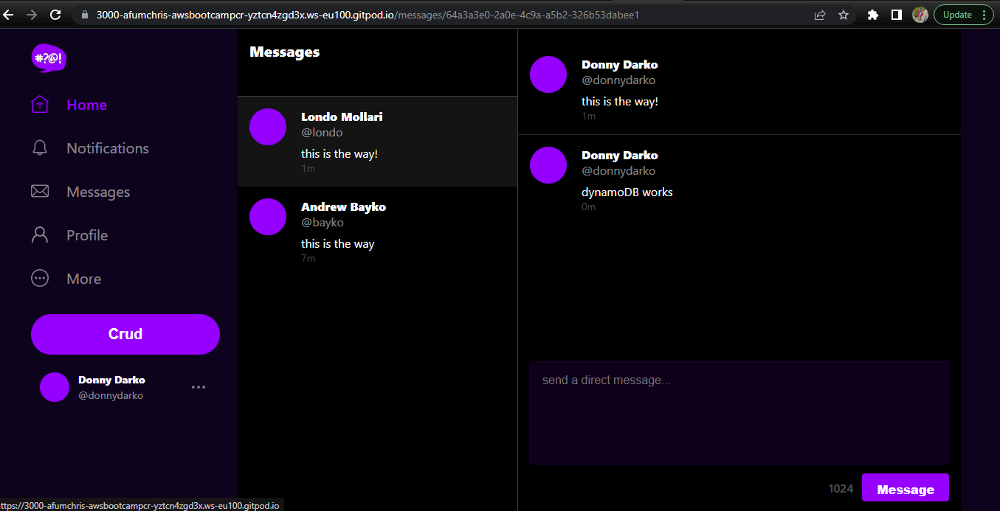

If the configuration is successful and there are no errors, you should not observe any errors in the CloudWatch logs. You can verify this by checking the CloudWatch service and navigating to the Log Groups section. Look for the log group named `/aws/lambda/cruddur-messaging-stream` as shown in the provided screenshots. 

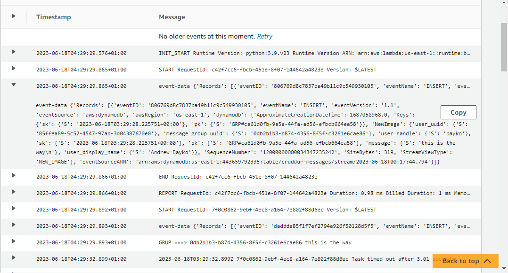

### Fix Timezone

Make the following changes as seen in this [commit](https://github.com/afumchris/aws-bootcamp-cruddur-2023/commit/459d77104acb6e28036f4016fa5c5728d518c0bf) to fix the timezone

  - `backend-flask/lib/ddb.py`:
    - Replace conversion of time to UTC and back to the local timezone with a direct `datetime.now()` call.
    - Use `datetime.now().isoformat()` to set the `created_at` timestamp accurately.
  - `bin/ddb/seed`:
    - Adjust the creation of `created_at` timestamp by subtracting a day and adding minutes.
  - `frontend-react-js/src/components/ActivityContent.js`:
    - Update the `format_time_created_at` and `format_time_expires_at` functions to format the timestamp.
    - Improve the logic for displaying time differences in the activity content.
  - `frontend-react-js/src/components/MessageGroupItem.js`:
    - Modify the `format_time_created_at` function to format the timestamp.
    - Implemente CSS classes based on the active message group UUID.
  - `frontend-react-js/src/components/MessageItem.css`:
    - Adjuste the CSS styles for the message item.
  - `frontend-react-js/src/components/MessageItem.js`:
    - Modify the `format_time_created_at` function to format the timestamp.
    - Update the JSX markup for the message item component.
  - `frontend-react-js/src/lib/DateTimeFormats.js`"
    - Add utility functions for formatting timestamps and calculating time differences.


### References

  - AWS DynamoDB Documentation [link](https://docs.aws.amazon.com/dynamodb/index.html)

