# Week 6/7 — Deploying Containers, Solving CORS with a Load Balancer and Custom Domain

## Table of Contents:

  - [Introduction](#introduction)
  - [Health Check](#health-check) 
  - [ECS Cluster and ECR Repository](#ecs-cluster-and-ecr-repository)
  - [Launching Containers on ECS](#launching-containers-on-ecs)
  - [Application Load Balancer](#application-load-balancer)
  - [Custom Domain Configuration](#custom-domain-configuration)
  - [Securing Backend-Flask](#securing-backend-flask)
  - [Dynamodb Working in Production](#dynamodb-working-in-production)
  - [Enable X-Ray For Frontend and Backend Task Definitions](#enable-x-ray-for-frontend-and-backend-task-definitions)
  - [Cost Consideration](#cost-consideration)


### Introduction

Week 6/7 objectives revolved around deploying containers on ECS (Elastic Container Service) using Fargate, hosting container images on ECR (Elastic Container Registry), addressing CORS (Cross-Origin Resource Sharing) challenges using a load balancer, and configuring a custom domain. 

### Health Check

health check involves evaluating various aspects of the application to ensure it is functioning properly and meeting the desired requirements.

#### performing health check to test RDS connection:

  - create a test script and make it executable `backend-flask/bin/db/test` as seen in this [commit](https://github.com/afumchris/aws-bootcamp-cruddur-2023/commit/97fbe8a7f0f31fe7d8589afd7c7985a0c822fdaf#diff-fbf3b7a44dbc91b3e8d181ab9bb8a8c92c3e76840879fa7e8e636b917603c521)
  - fix `update-sg-rule` file path in `.gitpod.yml` file as seeen in this [commit](https://github.com/afumchris/aws-bootcamp-cruddur-2023/commit/97fbe8a7f0f31fe7d8589afd7c7985a0c822fdaf#diff-370a022e48cb18faf98122794ffc5ce775b2606b09a9d1f80b71333425ec078e)

Manually run the command `export GITPOD_IP=$(curl ifconfig.me)` in the top directory, then navigate to the `backend-flask` directory and execute `./bin/rds/update-sg-rule` to update the security group. After that, run `./bin/db/test` to confirm the connection status. If everything is successful, you should see the expected message as shown in the screenshot below.

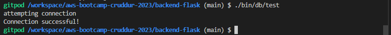

#### Health check for the flask app:

  - Modify the `app.py` file with health check endpoint for flask app as seen in this [commit](https://github.com/afumchris/aws-bootcamp-cruddur-2023/commit/97fbe8a7f0f31fe7d8589afd7c7985a0c822fdaf#diff-0014cc1f7ffd53e63ff797f0f2925a994fbd6797480d9ca5bbc5dc65f1b56438)
  - Create a health-check script and make it executable `backend-flask/bin/flask/health-check` as seen in this [commit](https://github.com/afumchris/aws-bootcamp-cruddur-2023/commit/97fbe8a7f0f31fe7d8589afd7c7985a0c822fdaf#diff-01d7ad6d634a3ec30374d54f33e9e024f562ff3eca15fdea99bb1119f41de4be)

### ECS Cluster and ECR Repository

Create an ECS (Elastic Container Service) cluster and an ECR (Elastic Container Registry) repository to store and manage the container images.

it is necessary to configure your AWS Account ID and HONEYCOMB API KEY as an environment variable:

```sh
export AWS_ACCOUNT_ID=123456789012
gp env AWS_ACCOUNT_ID=123456789012

export OTEL_EXPORTER_OTLP_HEADERS="x-honeycomb-team=$HONEYCOMB_API_KEY"
gp env OTEL_EXPORTER_OTLP_HEADERS="x-honeycomb-team=$HONEYCOMB_API_KEY"
```

#### Create Cloudwatch Log Group

To create a CloudWatch log group for ECS cluster and configure the log retention policy for a specific number of days, you can use the following command:

```sh
aws logs create-log-group --log-group-name cruddur
aws logs put-retention-policy --log-group-name cruddur --retention-in-days 1
```

#### Create ECS Cluster

create ECS cluster with the following command:

```sh
aws ecs create-cluster \
 --cluster-name cruddur \
 --service-connect-defaults namespace=cruddur
```

#### Create ECR Repositories and Push Images

Create repository for Python base-Image, backend-flask and frontend-react-js.

##### Python Base-Image

Execute this command to create a cruddur-python repository:

```sh
aws ecr create-repository \
 --repository-name cruddur-python \
 --image-tag-mutability MUTABLE
```

###### Login to ECR

To log in to the ECR repository you created for the Python base image and enable pushing images to the repository, you can execute the following command:

```sh
aws ecr get-login-password --region $AWS_DEFAULT_REGION | docker login --username AWS --password-stdin "$AWS_ACCOUNT_ID.dkr.ecr.$AWS_DEFAULT_REGION.amazonaws.com"
```

###### Set URL

set path for the address that will map to cruddur-python repository with this command:

```sh
export ECR_PYTHON_URL="$AWS_ACCOUNT_ID.dkr.ecr.$AWS_DEFAULT_REGION.amazonaws.com/cruddur-python"
echo $ECR_PYTHON_URL
```

###### Pull Python Base-Image:

```sh
docker pull python:3.10-slim-buster
```

To see what images are installed run `docker images`.

###### Tag Image:
```sh
docker tag python:3.10-slim-buster $ECR_PYTHON_URL:3.10-slim-buster
```

###### Push Image:
```sh
docker push $ECR_PYTHON_URL:3.10-slim-buster
```

##### Backend-flask

To utilize the Python image stored in Amazon Elastic Container Registry (ECR), you need to copy the URI of the image into your backend-flask Dockerfile as seen in this [commit](https://github.com/afumchris/aws-bootcamp-cruddur-2023/commit/97fbe8a7f0f31fe7d8589afd7c7985a0c822fdaf#diff-6f2b9638ec8f4b5a82a7ad3dce05eb963109f5a50c83a9aa342ae6dc0e5f374e). By doing this, you can reference and use the specific image stored in ECR during the Docker build process. Before pushing the image, ensure that you are logged in to ECR.

###### Create backend-flask Repository:
```sh
aws ecr create-repository \
 --repository-name backend-flask \
 --image-tag-mutability MUTABLE
```

###### Set URL:
```sh
export ECR_BACKEND_FLASK_URL="$AWS_ACCOUNT_ID.dkr.ecr.$AWS_DEFAULT_REGION.amazonaws.com/backend-flask"
echo $ECR_BACKEND_FLASK_URL
```

###### Build Image:
```sh
docker build -t backend-flask .
```

###### Tag Image:
```sh
docker tag backend-flask:latest $ECR_BACKEND_FLASK_URL:latest
```

###### Push Image:
```sh
docker push $ECR_BACKEND_FLASK_URL:latest
```

##### Frontend-react-js

To build and push the frontend-react-js image to ECR (Elastic Container Registry), follow these steps for a two-build-step process:

  - Create a new file `Dockerfile.prod` for frontend-react-js as seen in this [commit](https://github.com/afumchris/aws-bootcamp-cruddur-2023/commit/cdb6c46e97788cb9dc4c4699c98414d90c7bf501#diff-7c2adaca3e31bca71bdaf16d8980ce69b0f8125cbfddaf9d36f58ca7ef3e799b)
  - Create a new file `nginx.conf` as seen in this [commit](https://github.com/afumchris/aws-bootcamp-cruddur-2023/commit/1adf9b98720da1d75afb19ef824ba1d95604fc2e#diff-a6d1efa5086699305a622c303320902e92f271d483b71a873513d29c7222269e)
  - Modify `frontend-react-js/src/pages/ConfirmationPage.js` and `frontend-react-js/src/pages/RecoverPage.js` files to fix cognito errors using this [commit](https://github.com/afumchris/aws-bootcamp-cruddur-2023/commit/cdb6c46e97788cb9dc4c4699c98414d90c7bf501#diff-5cc5825850403ee1325a55220cdf3d9b19fe2efb228ad6458516c3eb45838349) and this [commit](https://github.com/afumchris/aws-bootcamp-cruddur-2023/commit/cdb6c46e97788cb9dc4c4699c98414d90c7bf501#diff-1fd5e87231653eb3d24b789918f2743c9702c7fea73d01afb8ea19c8c4062543)
  - Change into the frontend directory and run `npm run build`
  - Build image with the following command:

```sh
docker build \
--build-arg REACT_APP_BACKEND_URL="https://4567-$GITPOD_WORKSPACE_ID.$GITPOD_WORKSPACE_CLUSTER_HOST" \
--build-arg REACT_APP_AWS_PROJECT_REGION="$AWS_DEFAULT_REGION" \
--build-arg REACT_APP_AWS_COGNITO_REGION="$AWS_DEFAULT_REGION" \
--build-arg REACT_APP_AWS_USER_POOLS_ID="your_REACT_APP_AWS_USER_POOLS_ID" \
--build-arg REACT_APP_CLIENT_ID="your_REACT_APP_CLIENT_ID" \
-t frontend-react-js \
-f Dockerfile.prod \
.
```

###### Create frontend-react-js Repository:
```sh
aws ecr create-repository \
  --repository-name frontend-react-js \
  --image-tag-mutability MUTABLE
```

###### Set URL:
```sh
export ECR_FRONTEND_REACT_URL="$AWS_ACCOUNT_ID.dkr.ecr.$AWS_DEFAULT_REGION.amazonaws.com/frontend-react-js"
echo $ECR_FRONTEND_REACT_URL
```

Before tagging and pushing the image, ensure that you are logged in to ECR.

###### Tag Image:
```sh
docker tag frontend-react-js:latest $ECR_FRONTEND_REACT_URL:latest
```

###### Push Image:
```sh
docker push $ECR_FRONTEND_REACT_URL:latest
```

###### Test the frontend-react-js image locally by running the following command:
```sh
docker compose up backend-flask db

docker run --rm -p 3000:3000 -it frontend-react-js
```

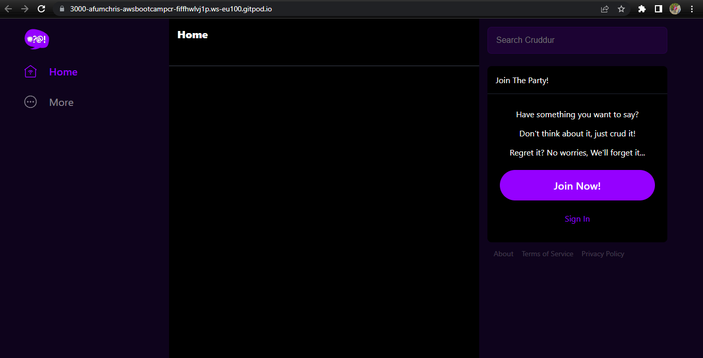


Go to the AWS Management Console and access AWS ECR (Elastic Container Registry). Navigate to the Repositories section to confirm if the images were created successfully and are visible in the registry.

### Launching Containers on ECS
Deploy the containers onto the ECS cluster, utilizing the container images stored in the ECR repository.

#### Create Task and Execution Roles for Task definition

Prior to creating the task and execution roles for the task definition, set the environment variables in AWS System Manager Parameter Store using the following commands:

```sh
aws ssm put-parameter --type "SecureString" --name "/cruddur/backend-flask/AWS_ACCESS_KEY_ID" --value $AWS_ACCESS_KEY_ID
aws ssm put-parameter --type "SecureString" --name "/cruddur/backend-flask/AWS_SECRET_ACCESS_KEY" --value $AWS_SECRET_ACCESS_KEY
aws ssm put-parameter --type "SecureString" --name "/cruddur/backend-flask/CONNECTION_URL" --value $PROD_CONNECTION_URL
aws ssm put-parameter --type "SecureString" --name "/cruddur/backend-flask/ROLLBAR_ACCESS_TOKEN" --value $ROLLBAR_ACCESS_TOKEN
aws ssm put-parameter --type "SecureString" --name "/cruddur/backend-flask/OTEL_EXPORTER_OTLP_HEADERS" --value "x-honeycomb-team=$HONEYCOMB_API_KEY"
```

Navigate to the AWS Management Console and select AWS Systems Manager. From there, access the Parameter Store to ensure that the values were accurately set.

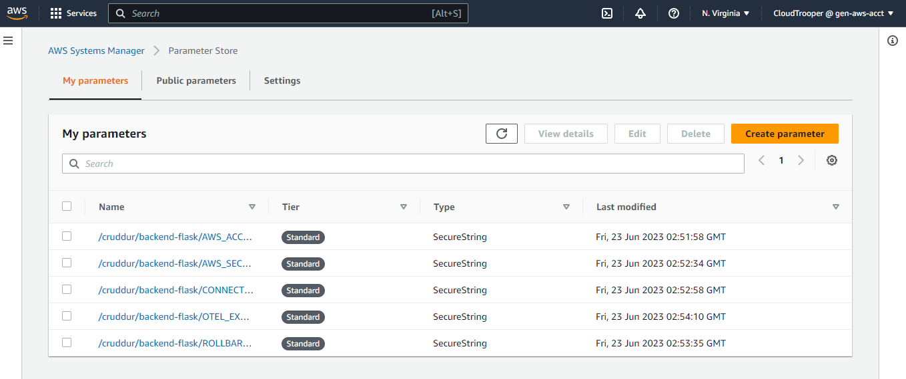

Based on the provided commits, create separate files holding the AWS policies for the `CruddurServiceExecutionRole` [commit](https://github.com/afumchris/aws-bootcamp-cruddur-2023/commit/97fbe8a7f0f31fe7d8589afd7c7985a0c822fdaf#diff-140ff34ff4760d0e7e2c4fbf70b1c1d07b7ac054bb074512615f53f6f03f3398) and `CruddurServiceExecutionPolicy` [commit](https://github.com/afumchris/aws-bootcamp-cruddur-2023/commit/97fbe8a7f0f31fe7d8589afd7c7985a0c822fdaf#diff-d48147539acff3a143fc19696e28187238e9a56bf6788bcd816a34572897a6f6). Then, proceed to establish the ExecutionRole and associate the policies using the provided commands:


```sh
aws iam create-role \
  --role-name CruddurServiceExecutionRole \
  --assume-role-policy-document file://aws/policies/service-assume-role-execution-policy.json

aws iam put-role-policy \
  --policy-name CruddurServiceExecutionPolicy \
  --role-name CruddurServiceExecutionRole \
  --policy-document file://aws/policies/service-execution-policy.json

aws iam attach-role-policy \
  --policy-arn arn:aws:iam::aws:policy/CloudWatchFullAccess \
  --role-name CruddurServiceExecutionRole

aws iam attach-role-policy \
  --policy-arn arn:aws:iam::aws:policy/service-role/AmazonECSTaskExecutionRolePolicy \
  --role-name CruddurServiceExecutionRole
```

Next, create the TaskRole named "CruddurTaskRole" and attach the necessary policies to it:

```sh
aws iam create-role \
    --role-name CruddurTaskRole \
    --assume-role-policy-document "{
  \"Version\":\"2012-10-17\",
  \"Statement\":[{
    \"Action\":[\"sts:AssumeRole\"],
    \"Effect\":\"Allow\",
    \"Principal\":{
      \"Service\":[\"ecs-tasks.amazonaws.com\"]
    }
  }]
}"

aws iam put-role-policy \
  --policy-name SSMAccessPolicy \
  --role-name CruddurTaskRole \
  --policy-document "{
  \"Version\":\"2012-10-17\",
  \"Statement\":[{
    \"Action\":[
      \"ssmmessages:CreateControlChannel\",
      \"ssmmessages:CreateDataChannel\",
      \"ssmmessages:OpenControlChannel\",
      \"ssmmessages:OpenDataChannel\"
    ],
    \"Effect\":\"Allow\",
    \"Resource\":\"*\"
  }]
}"

aws iam attach-role-policy \
  --policy-arn arn:aws:iam::aws:policy/CloudWatchFullAccess \
  --role-name CruddurTaskRole

aws iam attach-role-policy \
  --policy-arn arn:aws:iam::aws:policy/AWSXRayDaemonWriteAccess \
  --role-name CruddurTaskRole
```

Go to the AWS Management Console and access the IAM (Identity and Access Management) service. Verify if the task and execution roles for the task definition have been successfully created in the console.


#### Backend-flask ECS Task Definition

Using the provided [commit](https://github.com/afumchris/aws-bootcamp-cruddur-2023/commit/732daa60d14c9f31e9b7f6750f440d809b09c1b5#diff-fce4cbfaaa6ae500dea2961ebd2e8395ff961a7a764b1cebc1f11325d50a2866) as a guide, create a Task Definition file  `aws/task-definitions/backend-flask.json`. Be sure to modify the values in the JSON file to match those of your AWS account.

##### Register Task Definition for Backend-flask:
```sh
aws ecs register-task-definition --cli-input-json file://aws/task-definitions/backend-flask.json
```

Navigate to the AWS Management Console and go to AWS ECS (Elastic Container Service). Check the Task Definitions section to verify if the task definition has been successfully created in the console.

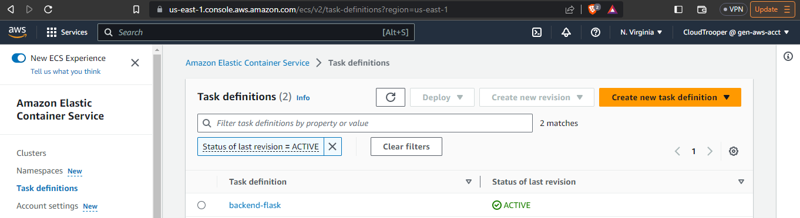

##### Security Group for Backend-flask Service

To obtain the DEFAULT_VPC_ID and DEFAULT_SUBNET_IDS required for creating a security group named `crud-srv-sg` with inbound rules for port `4567`, you can use the following AWS CLI commands:

```sh
export DEFAULT_VPC_ID=$(aws ec2 describe-vpcs \
--filters "Name=isDefault, Values=true" \
--query "Vpcs[0].VpcId" \
--output text)
echo $DEFAULT_VPC_ID

export DEFAULT_SUBNET_IDS=$(aws ec2 describe-subnets  \
 --filters Name=vpc-id,Values=$DEFAULT_VPC_ID \
 --query 'Subnets[*].SubnetId' \
 --output json | jq -r 'join(",")')
echo $DEFAULT_SUBNET_IDS
```

To create a security group named `crud-srv-sg` and allow inbound traffic on port `4567`, execute the following commands:

```sh
export CRUD_SERVICE_SG=$(aws ec2 create-security-group \
  --group-name "crud-srv-sg" \
  --description "Security group for Cruddur services on ECS" \
  --vpc-id $DEFAULT_VPC_ID \
  --query "GroupId" --output text)
echo $CRUD_SERVICE_SG

aws ec2 authorize-security-group-ingress \
  --group-id $CRUD_SERVICE_SG \
  --protocol tcp \
  --port 4567 \
  --cidr 0.0.0.0/0
```

Navigate to the AWS Management Console and select EC2 (Elastic Compute Cloud). Go to the Security Groups section to confirm if the security group, `crud-srv-sg`, was created successfully and if the inbound rules for port `4567` were set accordingly.

##### Create ECS Cluster Service for Backend-flask

using this [commit](https://github.com/afumchris/aws-bootcamp-cruddur-2023/commit/97fbe8a7f0f31fe7d8589afd7c7985a0c822fdaf#diff-a2eea4c74369eeb48e7b10271b7e8b62e4487c546a362ab3367656b4ed299099), create file in `aws/json/service-backend-flask`. Be sure to modify the security group id and subnets in the file to match those of your AWS account.

Execute this command to create a service:
```sh
aws ecs create-service --cli-input-json file://aws/json/service-backend-flask.json
```

In the AWS Management Console, navigate to ECS (Elastic Container Service) clusters. Locate the backend service and access the Service tab to verify if the service is running. Additionally, check the health check status to ensure that it is showing as healthy.

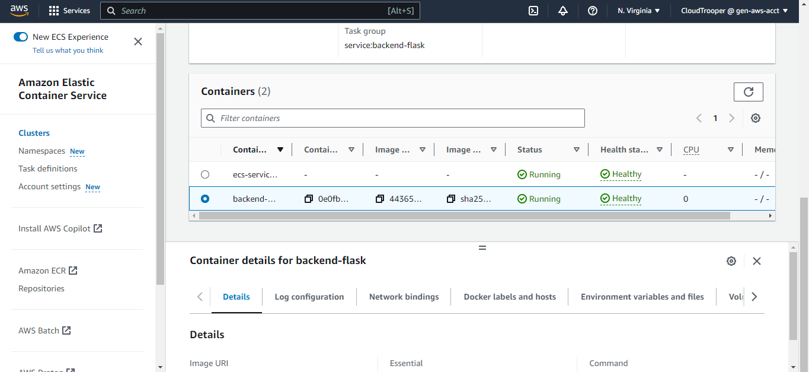


###### Connect to the backend-flask container by utilizing AWS Systems Manager Session Manager.

As seen in this [commit](https://github.com/afumchris/aws-bootcamp-cruddur-2023/commit/97fbe8a7f0f31fe7d8589afd7c7985a0c822fdaf#diff-5e69de896a2f2b06791ac316dc95f94b7e0e3313e2fb66f80d2c367a215fa545) create a new file `backend-flask/bin/ecs/connect-to-service` and make it executable.

Install Sessions Manager plugin for Linux and access the ECS cluster via the CLI with the following commands:

```sh
curl "https://s3.amazonaws.com/session-manager-downloads/plugin/latest/ubuntu_64bit/session-manager-plugin.deb" -o "session-manager-plugin.deb"

sudo dpkg -i session-manager-plugin.deb
```

To verify that it was successfully installed, run:  `session-manager-plugin`

Based on the provided [commit](https://github.com/afumchris/aws-bootcamp-cruddur-2023/commit/97fbe8a7f0f31fe7d8589afd7c7985a0c822fdaf#diff-370a022e48cb18faf98122794ffc5ce775b2606b09a9d1f80b71333425ec078e), make the necessary modifications to the `.gitpod.yml` file to ensure that AWS Systems Manager Session Manager is installed every time the environment is launched.

To connect to the container, execute the following command in the terminal:

```sh
./bin/ecs/connect-to-backend-service <task ARN ID>
```

Edit the inbound rule of the RDS instance security group to grants access to the `crud-srv-sg` security group, then run `./bin/db/test` to test RDS connection.

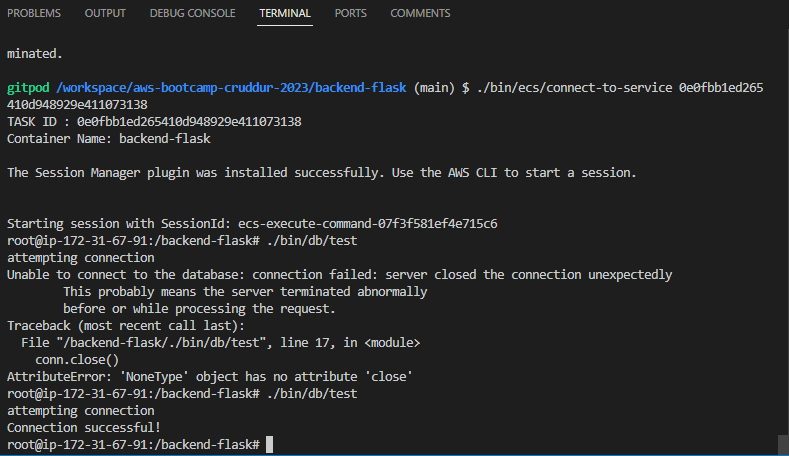

#### Frontend-react-js ECS Task Definition

Using the provided [commit](https://github.com/afumchris/aws-bootcamp-cruddur-2023/commit/732daa60d14c9f31e9b7f6750f440d809b09c1b5#diff-b1ee9974828856aa33e1eae739e5a1e7b07a9bdbee3b5665e040a451cba663ff) as a guide, create a Task Definition file  `aws/task-definitions/frontend-react-js.json`. Be sure to modify the values in the JSON file to match those of your AWS account.

##### Register Task Definition for Frontend-react-js:
```sh
aws ecs register-task-definition --cli-input-json file://aws/task-definitions/frontend-react-js.json
```

Navigate to the AWS Management Console and go to AWS ECS (Elastic Container Service). Check the Task Definitions section to verify if the task definition has been successfully created in the console.

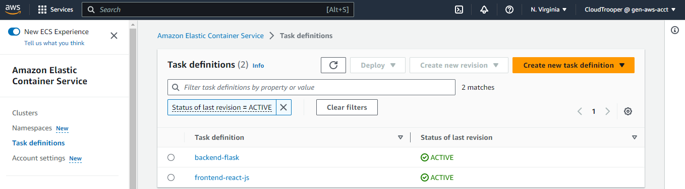

### Application Load Balancer

To provision and configure an Application Load Balancer (ALB) and target groups via the AWS console, follow these steps:

  - Access the AWS Management Console and navigate to the EC2 service.
  - Choose "Load Balancers" from the sidebar menu and click on the "Create Load Balancer" button.
  - Configure the basic settings as follows:
    - Name: cruddur-alb
    - Scheme: Internet-facing
    - IP address type: IPv4
  - Configure the network mapping:
    - Choose the default VPC.
    - Select all availability zones.
  - Set up the security groups:
    - Create a new security group named cruddur-alb-sg.
  - Configure inbound rules as follows:
    - HTTP and HTTPS from anywhere.
    - Custom TCP rules for ports 4567 and 3000 from anywhere.
  - Edit the inbound rules of the security group crud-srv-sg:
    - Set the port source from cruddur-alb-sg.
    - Set the description of port 4567 as ALBbackend and port 3000 as ALBfrontend.
  - Configure listeners and routing:
    - Create an HTTP listener on port 4567 and associate it with a new target group named cruddur-backend-flask-tg.
    - Set the target type as IP addresses.
    - Configure the health check path as /api/health-check with a healthy threshold of 3.
    - Get the ARN of this target group to use in the aws/json/service-backend-flask.json file.
    - Add another HTTP listener on port 3000 and associate it with a new target group named cruddur-frontend-react-js.
    - No need to configure a health check for this target group.
    - Set the healthy threshold to 3.
    - Get the ARN of this target group to use in the aws/json/service-frontend-react-js.json file.

#### Intergrate ALB with backend-flask

Modify `aws/json/service-backend-flask` file to use the ALB you just created as seen in this [commit](https://github.com/afumchris/aws-bootcamp-cruddur-2023/commit/732daa60d14c9f31e9b7f6750f440d809b09c1b5#diff-a2eea4c74369eeb48e7b10271b7e8b62e4487c546a362ab3367656b4ed299099)

To provision the backend-flask service again, execute the following command:

```sh
aws ecs create-service --cli-input-json file://aws/json/service-backend-flask.json
```

In the AWS Management Console, navigate to ECS (Elastic Container Service) clusters. Locate the backend service and access the Service tab to verify if the service is running. Additionally, check the service health check status and the backend-flask target group to ensure that it is showing as healthy.


#### Intergrate ALB with frontend-react-js

Create a new file `aws/json/service-frontend-react-js.json` as seen in this [commit](https://github.com/afumchris/aws-bootcamp-cruddur-2023/commit/732daa60d14c9f31e9b7f6750f440d809b09c1b5#diff-e6843ade525f0a7ca02583ea7f8310878228cb53977ad3c62dfa7e16a7f8b67e)

Rebuild the frontend-react-js image to utilize the ALB (Application Load Balancer) as the backend_url by following these steps, also make sure you are in the frontend-react-js directory before running these commands:

###### Build Image:

```sh
docker build \
--build-arg REACT_APP_BACKEND_URL="http://your_Load_Balancer_DNS_Host_Name" \
--build-arg REACT_APP_AWS_PROJECT_REGION="$AWS_DEFAULT_REGION" \
--build-arg REACT_APP_AWS_COGNITO_REGION="$AWS_DEFAULT_REGION" \
--build-arg REACT_APP_AWS_USER_POOLS_ID="your_REACT_APP_AWS_USER_POOLS_ID" \
--build-arg REACT_APP_CLIENT_ID="your_REACT_APP_CLIENT_ID" \
-t frontend-react-js \
-f Dockerfile.prod \
.
```

###### Tag Image:
```sh
docker tag frontend-react-js:latest $ECR_FRONTEND_REACT_URL:latest
```

###### Push Image:
```sh
docker push $ECR_FRONTEND_REACT_URL:latest
```

Edit the `crud-srv-sg` security group on the AWS Management Console to allow inbound traffic on port 3000 from the ALB (Application Load Balancer) security group by following these steps:

  - Open the AWS Management Console and navigate to the EC2 service.
  - Select Security Groups from the sidebar menu.
  - Locate the `crud-srv-sg` security group to edit and click on its ID or name.
  - In the Inbound Rules tab, click on the Edit inbound rules button.
  - Add a new inbound rule by clicking on "Add rule".
  - Set the following configurations for the inbound rule:
     - Type: Custom TCP
     - Port Range: 3000
     - Source: Select "Custom" and enter the security group ID of the ALB security group.
 - Click on the "Save rules" or "Apply" button to apply the changes.

Execute this command to create a service:
```sh
cd ..

aws ecs create-service --cli-input-json file://aws/json/service-frontend-react-js.json
```

In the AWS Management Console, navigate to ECS (Elastic Container Service) clusters. Locate the frontend service and access the Service tab to verify if the service is running. Additionally, check the service health check status and the frontend target group to ensure that it is showing as healthy.

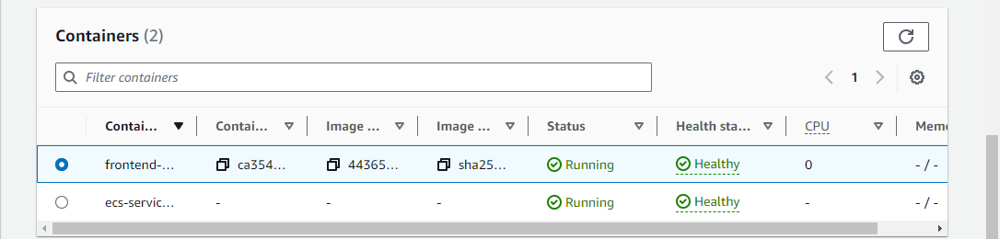

Navigate to the ALB (Application Load Balancer) tab in the AWS Management Console. Copy the DNS hostname associated with the ALB and paste it into your web browser. Append `:3000` to the hostname and hit Enter. You should now be able to view the frontend application with the corresponding data as shown below

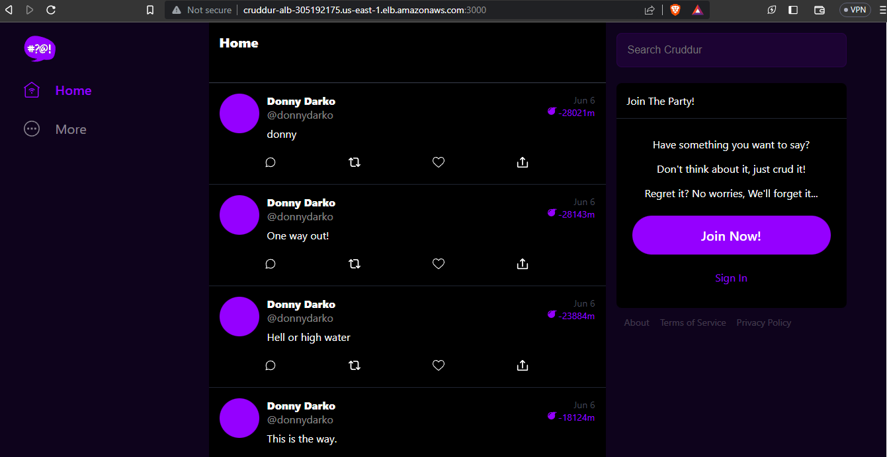


### Custom Domain Configuration

I registered the domain name `adikaifeanyi.com` for this bootcamp using Namecheap. To manage the `adikaifeanyi.com` domain and configure the necessary settings, follow these steps:

 - Configure Hosted Zone:
    - Access Route 53 > Hosted zones in the AWS Management Console.
    - Create a new hosted zone for `adikaifeanyi.com` with the "public" type.
    - Copy the provided NS record values.
    - Update the nameservers in the Namecheap DNS settings.
 - Request SSL Certificate:
    - Go to Certificate Manager (ACM).
    - Request a public certificate.
    - Add the domain names `adikaifeanyi.com` and `*.adikaifeanyi.com`.
    - Once the certificate is issued, select it.
    - Click "Create records in Route 53" to generate two CNAME records in Route 53.
 - Configure Load Balancers:
    - Access Load Balancers in the AWS Management Console.
    - Add a listener to redirect HTTP (port 80) to HTTPS (port 443).
    - Create another listener for HTTPS (port 443) and forward traffic to `frontend-react-js` using the SSL certificate.
    - Edit the rules for HTTPS (port 443) to include a condition that sets the Host Header as `api.adikaifeanyi.com` and forwards traffic to the `backend-flask` target group.
 - Set up Record Sets:
    - Navigate to the hosted zone for `adikaifeanyi.com` in Route 53.
    - Create a record set without a specific record name.
    - Set the type as "A - Route Traffic to an IPv4 address and some AWS resources".
    - Choose "Alias to Application and Classic Load Balancer" as the routing target.
    - Specify the correct region and load balancer.
    - Set the routing policy as simple routing.
    - Repeat the above step for the record name `api.adikaifeanyi.com`.

To get domain name working, update task definition for `backend-flask` and rebuild the `frontend-react-js image`

#### Update task definition for backend-flask

Modify `aws/task-definitions/backend-flask.json` file as seen in this [commit](https://github.com/afumchris/aws-bootcamp-cruddur-2023/commit/80956c6d1a0020eee6f2d1b53159a0cc45f9de02) to use the right environment variable.

#### Register Task Definition for Backend-flask:
```sh
aws ecs register-task-definition --cli-input-json file://aws/task-definitions/backend-flask.json
```

#### Rebuild the frontend-react-js

###### ECR Login:
```sh
aws ecr get-login-password --region $AWS_DEFAULT_REGION | docker login --username AWS --password-stdin "$AWS_ACCOUNT_ID.dkr.ecr.$AWS_DEFAULT_REGION.amazonaws.com"
```

###### Set URL:
```sh
export ECR_FRONTEND_REACT_URL="$AWS_ACCOUNT_ID.dkr.ecr.$AWS_DEFAULT_REGION.amazonaws.com/frontend-react-js"
echo $ECR_FRONTEND_REACT_URL
```

###### Build image:
```sh
cd frontend-react-js/

docker build \
--build-arg REACT_APP_BACKEND_URL="https://api.adikaifeanyi.com" \
--build-arg REACT_APP_AWS_PROJECT_REGION="$AWS_DEFAULT_REGION" \
--build-arg REACT_APP_AWS_COGNITO_REGION="$AWS_DEFAULT_REGION" \
--build-arg REACT_APP_AWS_USER_POOLS_ID="your_REACT_APP_AWS_USER_POOLS_ID" \
--build-arg REACT_APP_CLIENT_ID="your_REACT_APP_CLIENT_ID" \
-t frontend-react-js \
-f Dockerfile.prod \
.
```

###### Tag Image:
```sh
docker tag frontend-react-js:latest $ECR_FRONTEND_REACT_URL:latest
```

###### Push Image:
```sh
docker push $ECR_FRONTEND_REACT_URL:latest
```

update the Backend-Flask and Frontend-React-JS services in Amazon Elastic Container Service (ECS) to force a new deployment with the latest configurations by following these steps:

 - For Backend-Flask Service:
    - Access the AWS Management Console and navigate to the ECS service.
    - Choose the cluster that contains the Backend-Flask service.
    - Select the Backend-Flask service from the list.
    - In the service details page, click on the "Update" button.
    - Check the box for "Force new deployment"
    - For Revision select LATEST
    - Review the changes and click on the "Update" button to initiate the update process.
 - For Frontend-React-JS Service:
    - Select the Frontend-react-js service from the list.
    - In the service details page, click on the "Update" button.
    - Check the box for "Force new deployment"
    - For Revision select LATEST
    - Review the changes and click on the "Update" button to initiate the update process.

In the AWS Management Console, navigate to ECS (Elastic Container Service) clusters. Locate the frontend and backend service, access each Service tab to verify if the services are running. Additionally, check the service health check status and the frontend and backend target group to ensure that it is showing as healthy. Type adikaifeanyi.com and you should see this:

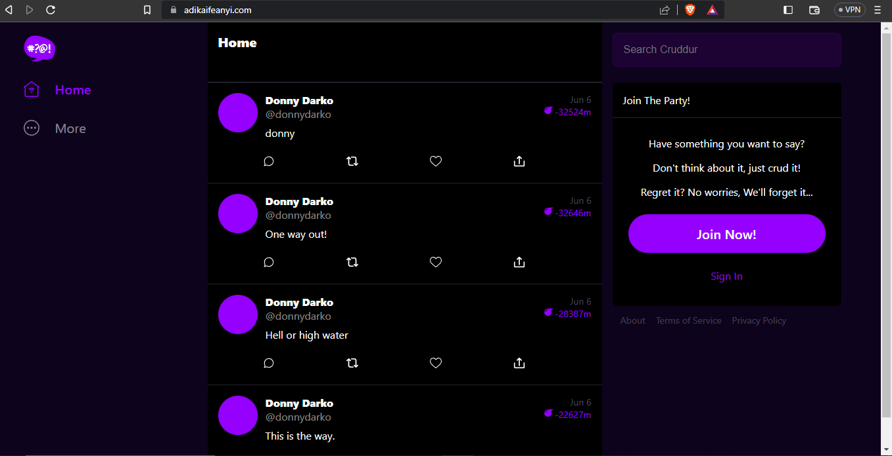

### Securing Backend-Flask

To ensure the security, performance, and stability of your production environment, it is recommended to disable development servers and built-in debuggers. Instead, employ proper logging and monitoring practices to capture relevant information for troubleshooting purposes while keeping your production environment secure and optimized. 

Modify `backend-flask/Dockerfile` to include debug flag as seen in this [commit](https://github.com/afumchris/aws-bootcamp-cruddur-2023/commit/2ac24522de1463a4f8600f96399647079d8e3ece#diff-6f2b9638ec8f4b5a82a7ad3dce05eb963109f5a50c83a9aa342ae6dc0e5f374e)

Create a new file `backend-flask/Dockerfile.prod` that includes no-debug, no-debugger and no-reload as seen in this [commit](https://github.com/afumchris/aws-bootcamp-cruddur-2023/commit/2ac24522de1463a4f8600f96399647079d8e3ece#diff-6d225ea023d504cad1c7455b5e118da68be678d3e13b7df2a8abe8889610f50a) 

###### ECR Login:
```sh
aws ecr get-login-password --region $AWS_DEFAULT_REGION | docker login --username AWS --password-stdin "$AWS_ACCOUNT_ID.dkr.ecr.$AWS_DEFAULT_REGION.amazonaws.com"
```

###### Build Image:
```sh
cd backend-flask/

docker build -f Dockerfile.prod -t backend-flask-prod .
```

###### Set URL:
```sh
export ECR_BACKEND_FLASK_URL="$AWS_ACCOUNT_ID.dkr.ecr.$AWS_DEFAULT_REGION.amazonaws.com/backend-flask"
echo $ECR_BACKEND_FLASK_URL
```

###### Tag Image:
```sh
docker tag backend-flask:latest $ECR_BACKEND_FLASK_URL:latest
```

###### Push Image:
```sh
docker push $ECR_BACKEND_FLASK_URL:latest
```

###### Force deploy backend-flask:

create a new file `backend-flask/bin/ecs/force-deploy-backend-flask` as seen in this [commit](https://github.com/afumchris/aws-bootcamp-cruddur-2023/commit/2ac24522de1463a4f8600f96399647079d8e3ece#diff-26a0dc79660877ef3d645d3f1b5db4fe6a67d029cffbe76e7f4b82293228b97d), make the file executable and run it with this command:

```sh
./bin/ecs/force-deploy-backend-flask
```

### Dynamodb Working in Production

In this [commit](https://github.com/afumchris/aws-bootcamp-cruddur-2023/commit/553c4cc299d691883f72000aa0f11dce3cd8051c?diff=unified#diff-4d4413b1b6b19e2bba84add763693470bf0abf242e3395c156c7b2a3a63b5ba1), the query_object_json method in the `backend-flask/lib/db.py` file was updated. The modifications involved improving the error handling and returning a default JSON object ({}) when there is no result.

After making changes to the `backend-flask/lib/db.py` file, the next step is to build the backend image incorporating these modifications and push it to the production environment.

###### Build Image:

Create a `bin/backend/build` script as seen in this [commit](https://github.com/afumchris/aws-bootcamp-cruddur-2023/commit/553c4cc299d691883f72000aa0f11dce3cd8051c?diff=unified#diff-5c69cef29f6005f929be402365eff3f8afb9df2ffa21186d83ac374ce79a4a5e) and execute it with the following command `./bin/backend/build`.

###### Push Image:

Create a `backend-flask/bin/docker/push/backend-flask-prod` script as seen in this [commit](https://github.com/afumchris/aws-bootcamp-cruddur-2023/commit/2ac24522de1463a4f8600f96399647079d8e3ece#diff-5dcb7ec0fb453e459233265529b912a136f7859b2dd66aeac6e0e76dc19594ab), move the script to the `bin/backend` directory and rename it `push` as seen in this [commit](https://github.com/afumchris/aws-bootcamp-cruddur-2023/commit/553c4cc299d691883f72000aa0f11dce3cd8051c#diff-e413f1d0638e188c8ef81bf77f508dc58f2fa6361385e47702c7493bedd4e1e0), then execute it with the following command `./bin/backend/push`.

###### Deploy backend-flask:

Move `backend-flask/bin/ecs/force-deploy-backend-flask` script to `bin/backend/` directory and rename it `deploy` as seen in this [commit](https://github.com/afumchris/aws-bootcamp-cruddur-2023/commit/553c4cc299d691883f72000aa0f11dce3cd8051c#diff-e413f1d0638e188c8ef81bf77f508dc58f2fa6361385e47702c7493bedd4e1e0), then execute it with the following command `./bin/backend/deploy`.

#### confirm messaging

Insert mock user into RDS to confirm messaging using the provided commands: 

  - create a script `backend-flask/bin/ecs/connect-to-backend-flask` as seen in this [commit](https://github.com/afumchris/aws-bootcamp-cruddur-2023/commit/2e9d45da6d48fce736e2e87f41f23b7d1aa20d5c#diff-c89114d659d4870396f74ced4412c446f37288ba3b8d1f7b3e772f3b4fe4b4e4), move the script to `/bin/db/` directory and rename it `connect` as seen in this [commit](https://github.com/afumchris/aws-bootcamp-cruddur-2023/commit/553c4cc299d691883f72000aa0f11dce3cd8051c#diff-08c4aa961dff47eb9dc62d4ff67b06e16960ec2a77fd0314d14573170c96992e), then run the command `./bin/db/connect prod` to connect to the production database.
  - Enable expanded output mode by entering `\x` on.
  - Execute the command `select * from users;` to view the existing users.
  - Use the following command to insert the mock user into the users table:

```sh
INSERT INTO public.users (display_name, email, handle, cognito_user_id)
VALUES
  ('Londo Mollari','lmollari@centari.com' ,'londo' ,'MOCK');
```

  - Execute the command `select * from users;` again to verify that the mock user has been successfully inserted. To exit the database connection, type `\q`.

To verify if messaging is working, visit your domain name and you should be able to send a message as shown below

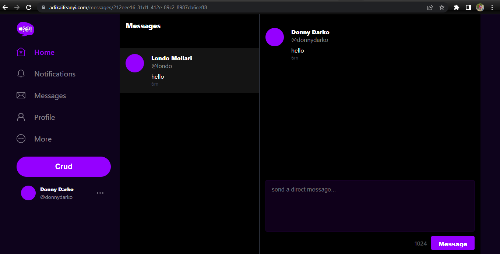

### Enable X-Ray For Frontend and Backend Task Definitions

To enable X-ray for both backend and frontend task definitions, implement the following modifications:

  - In the `backend-flask/services/user_activities.py` file as seen in this [commit](https://github.com/afumchris/aws-bootcamp-cruddur-2023/commit/c1a24a13baf2b4bdd2eff53c97f5a90a1edf16b3#diff-f5a1708fa9e56be428a37d6314e4ad7be8af74d9332ada2bc16913095fb0b4c6), Comment out the following, import statement for `xray_recorder` from the `aws_xray_sdk.core` module, the `xray_recorder.begin_subsegment('mock-data')`, and the `xray_recorder.end_subsegment()` line, which closes the subsegment.
  - as seen in this [commit](https://github.com/afumchris/aws-bootcamp-cruddur-2023/commit/e90233a9a75b63a9b049a1bd38095e99088af7b0#diff-fce4cbfaaa6ae500dea2961ebd2e8395ff961a7a764b1cebc1f11325d50a2866) and this [commit](https://github.com/afumchris/aws-bootcamp-cruddur-2023/commit/e90233a9a75b63a9b049a1bd38095e99088af7b0#diff-b1ee9974828856aa33e1eae739e5a1e7b07a9bdbee3b5665e040a451cba663ff), In the backend-flask task definition, the `healthCheck` command was modified from `/backend-flask/bin/flask/health-check` to `/backend-flask/bin/health-check`. A new container definition named "xray" was added for both files. This container is responsible for running the AWS X-Ray daemon, which is used for tracing and analyzing requests in the application.


Register the frontend and backend task definitions, and also after making changes to the `backend-flask/services/user_activities.py` file, the next step is to build the backend image incorporating these modifications and push it to the production environment.

###### Build Image:
```sh
./bin/backend/build
```

###### Push Image:
```sh
./bin/backend/push
```

###### Register backend task definition:

Create a script `bin/backend/register` as seen in this [commit](https://github.com/afumchris/aws-bootcamp-cruddur-2023/commit/e90233a9a75b63a9b049a1bd38095e99088af7b0#diff-0dabce0e76eea0e68c31089b7e457f85d82d751171f11179e5762ce5ed02c2bc) and execute it with the following command `./bin/backend/register`

###### Register frontend task definition:

Create a script `bin/frontend/register` as seen in this [commit](https://github.com/afumchris/aws-bootcamp-cruddur-2023/commit/e90233a9a75b63a9b049a1bd38095e99088af7b0#diff-8921592caf8bb1a59a42ff3e4f695a43b1c50087a5fd029fe181e8ed2f133353) and execute it with the following command `./bin/frontend/register`

###### Deploy backend-flask:
```sh
./bin/backend/deploy
```

###### Deploy frontend-react-js:

Create a script `bin/frontend/deploy` as seen in this [commit](https://github.com/afumchris/aws-bootcamp-cruddur-2023/commit/e90233a9a75b63a9b049a1bd38095e99088af7b0#diff-10873cdb459376dde5bea7e6d65ce9f9dcdc51632d8d371039592d0d78336f48) and execute it with the following command `./bin/frontend/deploy`

Go to the AWS console, access ECS (Elastic Container Service), and navigate to the "Tasks" section. There, you should find the following information displayed.

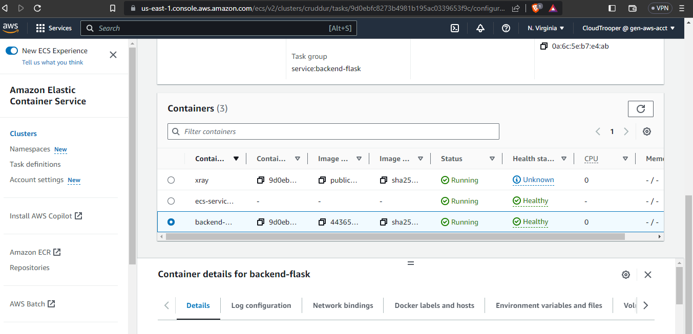


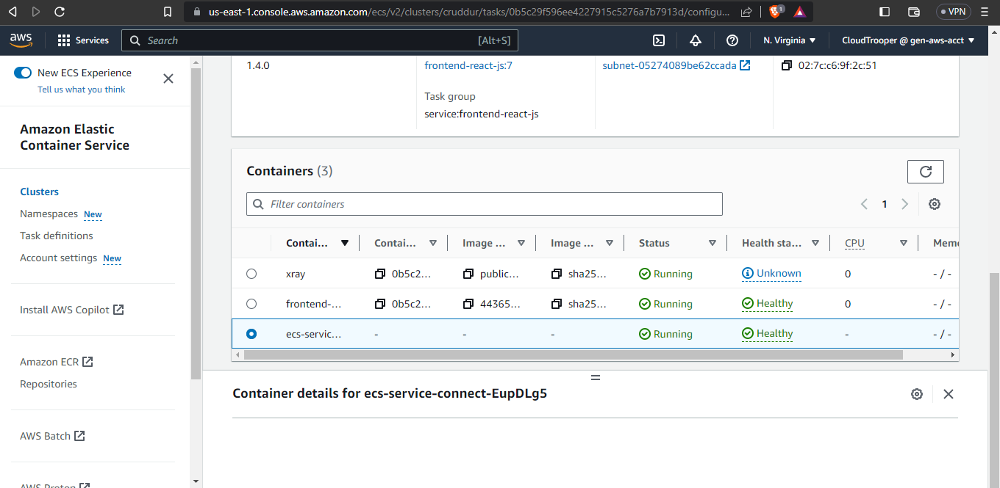

### Cost Consideration

To optimize costs on the AWS console, set the Fargate services to 0, which will help conserve your AWS budget. By doing so, you'll prevent any unnecessary usage and charges related to Fargate services while still keeping other essential resources active as needed.
