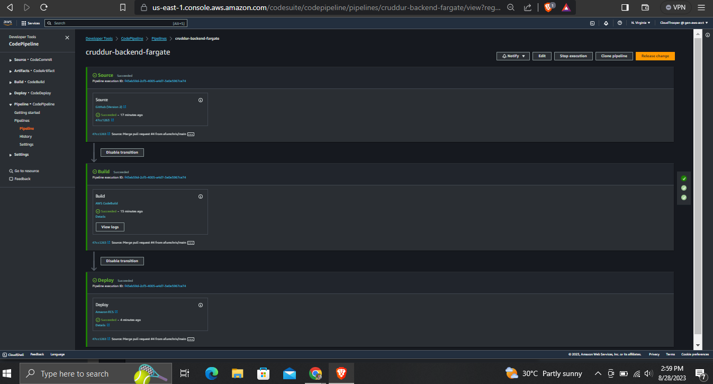
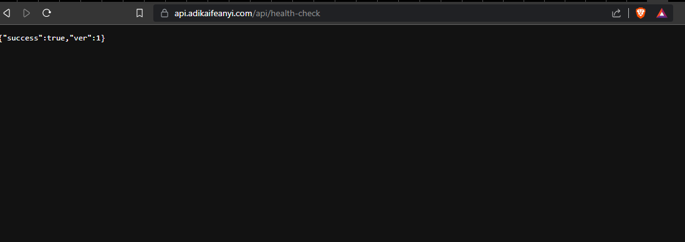

# Week 9 — CI/CD with CodePipeline, CodeBuild and CodeDeploy

## Table of Contents:

  - [Introduction](#introduction)
  - [Setup](#setup)
  - [AWS CodeBuild](#aws-codebuild)
  - [AWS CodePipeline](#aws-codepipeline)
  - [Testing the Pipeline](#testing-the-pipeline)

### Introduction

This week outlines the setup and configuration process for implementing a Continuous Integration and Continuous Deployment (CI/CD) pipeline for cruddur backend-flask application using AWS CodeBuild and AWS CodePipeline. The pipeline automates the building and deployment of cruddur application, streamlining the process and ensuring consistency. 

### Setup

- Create the folllowing scripts:
    - `backend-flask/buildspec.yml`: Customize the environment variables to match yours as seen in this [commit](https://github.com/afumchris/aws-bootcamp-cruddur-2023/commit/be88d1226edde94e4c8314a5e1bbf1f3348506c6#diff-7369f7fdbc7877277abce26913b78abbd2405db5af3fd18f25ded874cdd66def).
    - `aws/policies/ecr-codebuild-backend-role.json` as seen in this [commit](https://github.com/afumchris/aws-bootcamp-cruddur-2023/commit/be88d1226edde94e4c8314a5e1bbf1f3348506c6#diff-24fca630e9cd344461def376fcbcd6bbca8ec1869c27a8685ad82ed23329306f).
- Create a new branch named `prod` which will be utilized for AWS CodeBuild and CodePipeline in the subsequent steps.
- In AWS ECS, ensure that the `desired tasks` in the service are set to 1.

### AWS CodeBuild

Navigate to Codebuild on the AWS console and create a build project following the steps below:

- create a build project:
    - Project Name - `cruddur-backend-flask-bake-image`
    - enable the build badge.
- Source Configuration:
    - Choose GitHub as the source provider.
    - Select the repository in your GitHub account, specifically the `cruddur` repository.
    - Set the source version to `prod`
    - enable rebuild every time there's a code change pushed to this repository.
    - Choose "Single Build" and set the event type to "PULL_REQUEST_MERGED."
- Environment Configuration:
    - Select managed image.
    - Select the operating system as Amazon Linux 2.
    - Choose the standard runtime.
    - Select the latest image (version 4.0).
    - Set the environment type to Linux.
    - Enable the "privileged" option.
- Service Role Creation:
    - Automatically create a new service role named "codebuild-cruddur-backend-flask-bake-image-service-role."
- Timeout and Resource Configuration:
    - Reduce the timeout to 20 minutes for quicker feedback.
    - Do not select any certificate or VPC settings.
    - Allocate 3 GB of memory and 2 vCPUs for compute resources.
- Build Specification:
    - Utilize the buildspec file located at "backend-flask/buildspec.yml."
- Artifacts:
    - There are no artifacts to be generated for this build.
- Logging Configuration:
    - Select CloudWatch Logs.
    - Set the group name as "/cruddur/build/backend-flask."
    - Stream name should be "backend-flask."
- Service Role Policy Attachment:
    - Attach a policy, as described in "aws/policies/ecr-codebuild-backend-role.json," to the newly created service role. This step grants the necessary permissions.
- Finally, click `Create build project`

### AWS CodePipeline

Navigate to CodePipeline on the AWS console and set up a pipeline with the following steps:

- Pipeline Configuration:
    - Name the pipeline as `cruddur-backend-fargate`
    - Allow it to create a new service role automatically, which will be named `AWSCodePipelineServiceRole-us-east-1-cruddur-backend-fargate`.
    - Select default location and default managed key in advanced settings.
- Source Stage Configuration:
    - For the source stage, use GitHub (Version 2).
    - Click `Connect to GitHub`
    - Set the connection name as `cruddur`
    - Install a new app.
    - Select the `cruddur` repository.
    - Complete the `Connect to GitHub` setup and return to the pipeline page.
- Source Stage (Contd.):
    - Choose the `cruddur` repository.
    - Select the "prod" branch.
    - select start the pipeline automatically on any source code change.
    - Use the default output artifact format.
- Build Stage Configuration:
    - For the build stage, select AWS CodeBuild as the build provider.
    - Choose your region.
    - Select the newly created project, `cruddur-backend-flask-bake-image` for this stage.
- Deploy Stage Configuration:
    - Select `ECS` as the deployment provider.
    - For Region select your project region. 
    - Choose the `cruddur` cluster.
    - For servive name select the `backend-flask` service.
- Create pipeline

### Testing the Pipeline

Follow these steps to test the pipeline:

- Modify the `backend-flask/app.py` file:

In the `backend-flask/app.py` file, update the `health_check` function as follows:
Change the return statement from return {"success": True}, 200 to return {"success": True, "ver": 1}, 200.

- Merge Branches:

Merge the changes made in the `week-9` branch into the `prod` branch. This merge action will automatically trigger the pipeline we previously set up.

- Verification:

Visit the following URL `https://api.<your_domain_name>/api/health-check`. You should see a JSON response like this: {"success": true, "ver": 1}. This confirms that the pipeline has successfully deployed the updated code.

Below is the proof of the successful pipeline execution after merging the pull request from `week-9`

